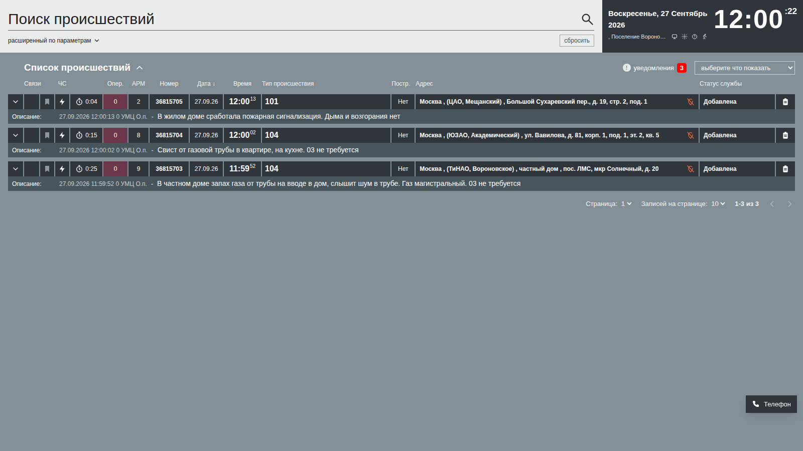
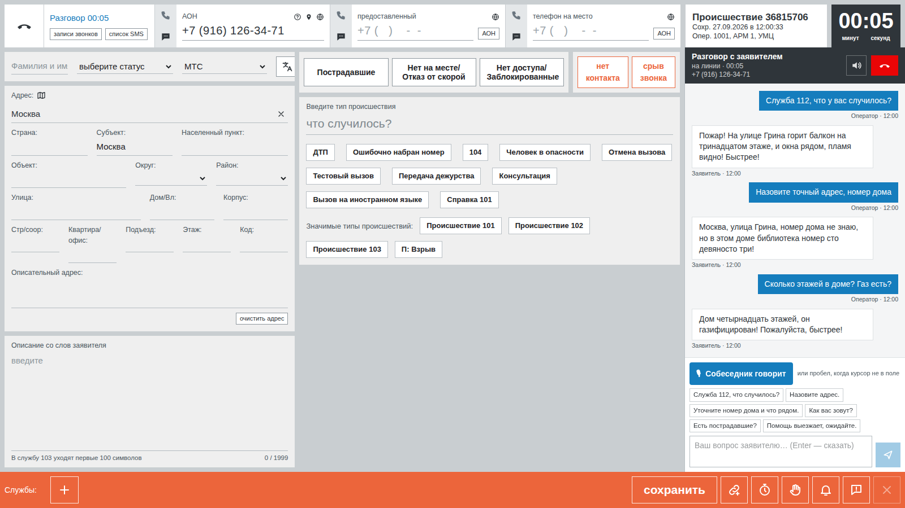

# Тренажёр оператора 112 и диспетчера ДДС

Учебное веб-приложение для класса Департамента ГОЧСиПБ. ИИ-заявитель звонит на место оператора 112. Оператор заполняет карточку, система сама подбирает службы по классификатору. Карточка уходит на места диспетчеров ДДС: они открывают её за 30 секунд, за 3 минуты делают первую запись — статус и текст — и ведут статусы по докладам бригады. Каждое действие разбирается по нормативам и памятке ДДС. Преподаватель видит весь класс с одного экрана и подтверждает оценку — ИИ только готовит черновик.

| Место диспетчера ДДС | Место оператора 112 |
|---|---|
|  |  |
| **Доска класса у преподавателя** | **Разбор попытки: черновик ИИ и решение преподавателя** |
|  |  |

## Что умеет

**Обучающийся — одна учётная запись, две роли:**
- **Место оператора 112** — копия АРМ-112 со скриншотов заказчика: входящий вызов, таймер набора, адрес, флаги, «что случилось» и опросные карты, автоподбор служб по классификатору v046_24, окно «Добавьте службы», горячие клавиши. ИИ-заявитель называет сначала приблизительный адрес, точный — только на уточняющий вопрос, факты — только если спросили; бывает тишина на линии и срыв звонка. Можно говорить голосом. Отработки по телефону в службы без АРМ, «Совпадение» для повторных вызовов, просмотр и дополнение сохранённой карточки.
- **Место диспетчера ДДС** — лента происшествий, карточка, полоса служб, окно статуса и синее окно истории как на скриншотах. Статусы строго по памятке. Карточки приходят потоком, у каждой свой таймер: 30 секунд — открыть карточку, 3 минуты — первая запись. Чужие службы меняют статусы сами. Старший бригады звонит с докладами, диспетчер может перезвонить заявителю и поставить звонок на удержание.
- **Разбор** каждой карточки: что не так, доказательство (время, цитата), как надо. Главная проверка места 112 — «сказал заявитель ↔ заполнил оператор».
- **Тренировка без занятия**: работать можно сразу после входа.
- **Мои задания, время реакции против норматива, справка** — памятка ДДС и горячие клавиши 112.
- **Мой прогноз**: уровень по каждой роли, ожидаемый балл на следующем занятии и шанс уложиться в норматив.

**Преподаватель:**
- группы и их состав; занятие — группа, места 112 и ДДС, службы, задания по местам, «одна карточка на всех», округ или район, критерии зачёта;
- живая доска класса с режимом проектора;
- подтверждение или правка черновика оценки с записью в журнал; правки «ИИ неправ» учитываются следующими проверками, которые делает модель;
- панель весов с мгновенным пересчётом всех попыток;
- адаптивная сложность: у каждого ученика уровень «как в шахматах» отдельно для 112 и ДДС, задания подбираются по силам — справляется уверенно, получает сложнее;
- прогноз на следующее занятие и зона риска; прогноз сохраняется на старте занятия и после него сверяется с фактом — ошибка и попадание в интервал видны в отчёте;
- отчёты: лидеры и отстающие с причинами, типичные ошибки группы, тепловая карта, согласие преподавателя с черновиком ИИ, CSV;
- сценарии: 96 ситуаций из билетов, 3 варианта с ошибкой в карточке и 4 по инструкции оператора (40 утверждены с эталоном), утверждение по разделам, «Сценарий из текста» — эксперт описывает ситуацию своими словами, «Сгенерировать по категории» — черновики по классификатору для выбранного округа или района.

**Администратор:** состояние системы в реальном времени, службы с пуском и остановкой (планировщик, модели ИИ, поток карточек), контроль целостности, статистика использования, пользователи и группы, журнал аудита и системный журнал с выгрузкой, резервные копии по расписанию, политики доступа и нормативы.

## Демо-стенд

**https://83.222.9.148.sslip.io** — вход по демо-учёткам ниже. Каждую ночь в 04:30 МСК стенд возвращается к исходному виду. Модели ИИ на стенде облачные; без них тренажёр работает на правилах.

## Запуск

### Docker (рекомендуется)

```bash
cp .env.example .env
docker compose --profile app up -d --build        # http://localhost:3000
```

С HTTPS (для микрофона) и в изолированном контуре без интернета — [docs/install.md](docs/install.md).

### Для разработки

Нужны Node.js 22+, pnpm 9+, Docker.

```bash
cp .env.example .env
pnpm install
pnpm db:up && pnpm db:migrate && pnpm db:seed    # PostgreSQL на 5442, учётки и справочники
pnpm exec tsx prisma/seed-demo.ts                # по желанию: демо-занятия с попытками
pnpm dev                                         # http://localhost:3100
```

## Демо-учётки

| Роль | Логин | Пароль |
|---|---|---|
| Администратор | `admin` | `Admin2026` |
| Преподаватель | `teacher` | `Teacher2026` |
| Обучающиеся | `student1` … `student5` | `Student2026` |

## Модели ИИ

Языковая модель, распознавание и синтез речи подключаются строками в `.env` (`LLM_*`, `STT_*`, `TTS_*`). Подходит любой сервер с OpenAI-совместимым API: облачный на стенде или локальный в контуре (Ollama или llama.cpp, faster-whisper, Piper). Без модели тренажёр работает на правилах: заявитель отвечает по фактам сценария, проверки, которым нужна модель, помечаются «не применимо». Голос без сервера речи работает через браузер.

## Документация

Вся документация одним файлом: [PDF](docs/documentation.pdf) · [DOCX](docs/documentation.docx) (собирается командой `pnpm exec tsx scripts/build-docs.ts`).

| Документ | О чём |
|---|---|
| [install.md](docs/install.md) | установка: Docker, HTTPS в классе, офлайн, модели |
| [architecture.md](docs/architecture.md) | компоненты, схема занятия, данные |
| [methods.md](docs/methods.md) | методы обработки данных: правила, модели, оценка, адаптация и прогноз |
| [data.md](docs/data.md) | классификатор, 211 служб, подбор служб, билеты |
| [op112.md](docs/op112.md) | место оператора 112, ИИ-заявитель, оценка |
| [dds.md](docs/dds.md) | место ДДС, статусы, поток карточек, оценка |
| [teacher.md](docs/teacher.md) | кабинеты преподавателя и обучающегося |
| [admin.md](docs/admin.md) | руководство администратора, резервные копии |
| [security.md](docs/security.md) | безопасность, персональные данные, 152-ФЗ |
| [performance.md](docs/performance.md) | нагрузочные испытания |
| [stand.md](docs/stand.md) | демо-стенд без присмотра |
| [licenses.md](docs/licenses.md) | библиотеки и модели с лицензиями |

## Проверки

```bash
pnpm typecheck && pnpm lint && pnpm test        # 757 автотестов
pnpm exec tsx scripts/e2e-lesson.ts             # сквозное занятие 112 → ДДС через API (нужен запущенный сервер)
pnpm exec tsx scripts/loadtest.ts --users 100  # нагрузка, варианты — в docs/performance.md
```

Нагрузка на production-сборке: 100 одновременных рабочих мест — p95 0,1 с без ошибок (в Docker — 0,69 с); база — около 5300 записей в секунду; отчёт занятия — меньше 0,1 с.

## Стек

Next.js 16, TypeScript, PostgreSQL 16, Prisma, Tailwind CSS; Caddy для HTTPS; Docker Compose.
