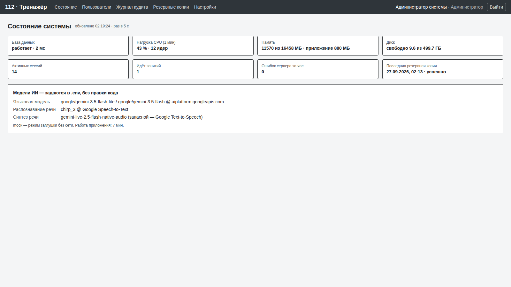
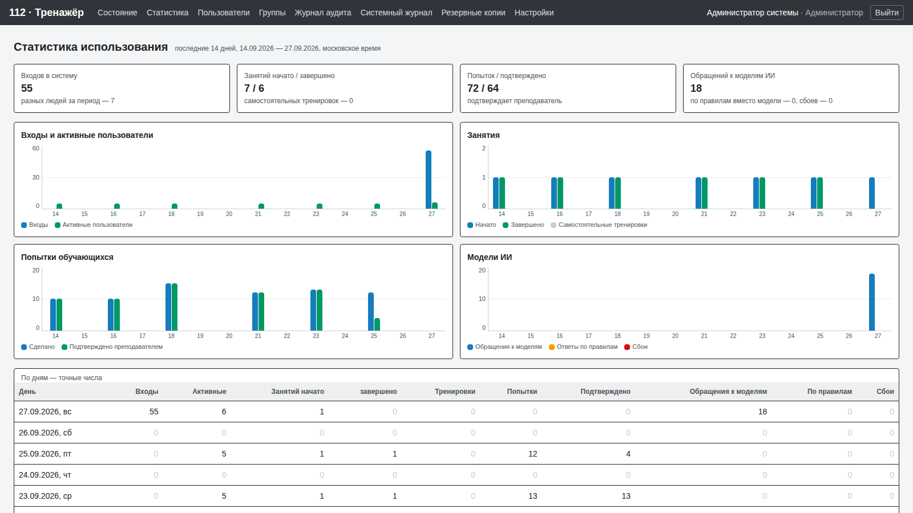
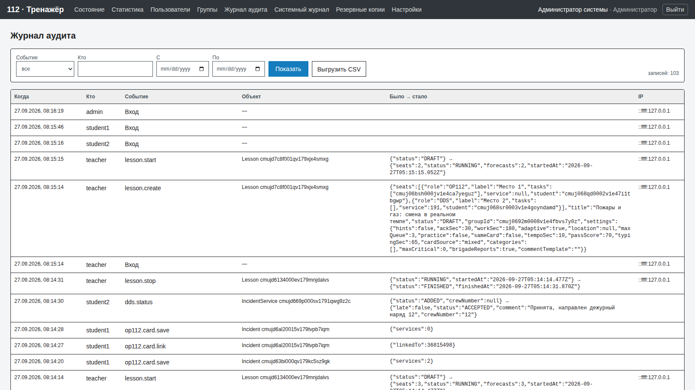

# Руководство администратора

Администратор входит под своей учётной записью и попадает на страницу «Состояние». Каждая страница и каждый запрос кабинета проверяют роль на сервере: преподаватель и обучающийся сюда не попадут даже по прямой ссылке.

## Состояние системы

Обновляется раз в 5 секунд: база данных и время отклика, нагрузка процессора, память, свободное место на диске, активные сессии, идущие занятия, ошибки сервера за последний час, последняя резервная копия. Красная рамка — повод вмешаться.



Над плитками появляются баннеры, если что-то не так: красный — последняя проверка целостности нашла проблему, жёлтый — какая-то служба остановлена.

Проверка для внешнего мониторинга без входа: `GET /api/health` → `{"ok":true}` (данных не раскрывает).

## Службы — состояние, пуск и остановка

На странице «Состояние», раздел «Службы». У каждой службы видно, что она делает сейчас; пуск и остановка пишутся в журнал (кто, когда, было → стало). Перед остановкой система спрашивает подтверждение и объясняет последствия.

| Служба | Что видно | Что будет при остановке |
|---|---|---|
| Планировщик | последний проход (раз в минуту), время копии и проверки, последняя копия | не делаются резервные копии, ежедневная проверка целостности и очистка журнала. Кнопка «Возобновить» — всё продолжается с ближайшего прохода |
| Модели ИИ | какие модели подключены в `.env`, сколько сегодня обращений, ответов по правилам и сбоев | ни один запрос к моделям не уходит: заявители и бригады отвечают по правилам, речь распознаёт и озвучивает браузер, ИИ-пункты оценки — «не применимо» с пометкой «модели ИИ выключены администратором», черновики разбора собирают правила. Так же система работает без подключённых моделей |
| Поток карточек ДДС | сколько идёт занятий, мест ДДС, карточек за последний час | на местах ДДС во всех идущих занятиях и самостоятельных тренировках перестают появляться новые карточки; начатые карточки, таймеры и звонки бригад продолжаются. Обучающийся видит «Новые карточки приостановлены администратором» |
| База данных | версия PostgreSQL, размер, число подключений, время ответа | из браузера не останавливается — без базы не открыть и эту страницу. На сервере: `docker compose stop db`, `docker compose start db` |
| Сервер приложения | номер процесса, время работы, память | из браузера не останавливается — остановка закрыла бы страницу. На сервере: `docker compose --profile app restart app` (перезапуск), `docker compose --profile app stop app` |

Состояние переключателя хранится в базе, поэтому его видят все процессы сервера (в Docker их несколько, `APP_WORKERS`) — не позже чем через 5 секунд. Планировщик работает в одном из процессов; если он не делает проход дольше 3 минут, карточка краснеет — перезапустите сервер.

**На демо-стенде** (`DEMO_MODE=true`) проверяющие не мешают друг другу: остановленная служба сама запускается через 15 минут (время показано на карточке), а ночной сброс стенда запускает все службы. Пауза планировщика не отменяет ночной сброс — именно он возвращает стенд в рабочее состояние.

## Контроль целостности

На странице «Состояние», раздел «Контроль целостности». Проверка идёт каждый день по расписанию (по умолчанию в 05:00 — после резервной копии и ночного сброса) и по кнопке «Проверить сейчас»:

1. База данных отвечает.
2. Все миграции из поставки применены и ни одна не зависла.
3. Справочники полные: группы и типы классификатора, правила маршрутизации, службы, сценарии из билетов — в базе не меньше, чем в файлах `data/*.json`.
4. Последняя успешная резервная копия моложе 26 часов, файл на месте, не пустой и читается (`pg_restore --list`); если после неё была неудачная попытка — это тоже проблема.
5. Свободного места на диске копий и приложения не меньше порога (по умолчанию 2 ГБ, меняется в настройках).

Если что-то не так — красный баннер вверху страницы «Состояние» с тем, что именно сломалось и что делать, запись «Контроль целостности: есть проблемы» в системном журнале и строка в журнале сервера. Проверка ничего не исправляет сама и ничего не меняет в данных.

## Статистика использования

Раздел «Статистика»: последние 14 дней по московскому времени — входы и активные пользователи, занятия (начато, завершено, отдельно самостоятельные тренировки), попытки обучающихся и подтверждённые преподавателем, обращения к моделям ИИ, ответы по правилам вместо модели и сбои моделей. Графики с шкалой от нуля и таблица с точными числами по дням, итоги за период и сколько всего в системе пользователей, групп, занятий, попыток и утверждённых сценариев.



Входы и активность берутся из журнала аудита, занятия и попытки — из их таблиц. Обращения к моделям считает сам сервер: каждый процесс копит счётчики в памяти и записывает их в базу раз в минуту, поэтому последняя минута может ещё не войти, а при аварийной остановке процесса она теряется.

## Пользователи

- Создание учётной записи: логин, ФИО, роль (администратор, преподаватель, обучающийся), пароль по политике — длина из «Политик доступа» (не меньше 8), буквы и цифры. Обучающегося можно сразу **добавить в группу** — без группы он не попадёт на занятие. В таблице видно, в каких группах ученик (оранжевое «без группы» — ещё ни в одной) и какие группы ведёт преподаватель.
- Блокировка и разблокировка. Заблокированный пользователь сразу теряет все сессии.
- Смена пароля. Все сессии пользователя завершаются.
- После нескольких неудачных входов подряд учётная запись закрывается на время — сколько попыток и на сколько минут, задают «Политики доступа».
- На демо-стенде (`DEMO_MODE=true`) демо-учётки защищены от блокировки и смены пароля, чтобы проверяющие не мешали друг другу.

## Группы

Раздел «Группы» — все группы центра: создать группу и назначить преподавателя, переименовать, добавить и убрать учеников, убрать группу в архив и вернуть. Преподаватель видит только свои группы и сам ведёт их состав; сменить преподавателя группы может только администратор. Подробно — [teacher.md](teacher.md), раздел 6.

## Журнал аудита

Каждое значимое действие записывается: входы и неудачные попытки, блокировки, изменения пользователей и настроек (было → стало), группы и их состав, занятия, работа на местах 112 и ДДС, подтверждение и правка оценок преподавателем, правки ИИ-проверок, веса оценки, сценарии, пуск и остановка служб, резервные копии, ошибки сервера. Фильтры по виду события, логину и датам, выгрузка в CSV для Excel.

Запись читается без справочника: кто — ФИО и логин, событие — по-русски, объект — как его знают люди (занятие «Название», попытка ученика с карточкой и занятием, карточка № N, служба на карточке, пользователь, группа, настройка), что изменилось — «поле: было → стало» с русскими названиями и московским временем; длинное раскрывается по щелчку. В CSV те же колонки, код события — последней колонкой, для фильтров в Excel. У каждого события, которое пишет код, есть русское название — это проверяет тест `tests/audit-labels.test.ts`.



Журнал хранится не меньше 6 месяцев: срок задаётся в настройках, но ниже 183 дней система его не опускает. Старые записи удаляет встроенный планировщик раз в час.

## Системный журнал

Раздел «Системный журнал» — что делала и что пережила сама система, отдельно от действий пользователей:

- ошибки сервера (отчёты о сбоях: адрес запроса и текст ошибки) и запуски сервера — перезапуск после сбоя виден по времени;
- резервные копии по расписанию и вручную, их ошибки;
- проверки целостности и их итог;
- пуск и остановка служб — администратором и системой (истёк срок остановки на демо-стенде, ночной сброс);
- очистка по расписанию, когда удалено что-то долгохранимое: старые записи журнала, копии, счётчики статистики;
- ночной сброс демо-стенда и его ошибки.

Фильтр по виду события и датам, выгрузка в CSV. Системный журнал — это выборка из того же хранилища, что и журнал аудита: тот же срок хранения, те же записи видны и там.

## Резервные копии

- Автоматически каждый день в заданное время (по умолчанию 03:00), хранятся заданное число дней (по умолчанию 14).
- Вручную — кнопка «Сделать копию сейчас».
- Формат — `pg_dump` custom, каталог задаётся `BACKUP_DIR` (в Docker — том `backups`).
- Свежесть и читаемость последней копии каждый день проверяет контроль целостности.

Восстановление выполняется из консоли сервера, когда не идёт занятие:

```bash
# Docker
docker compose exec app sh scripts/restore.sh /backups/trainer-2026-09-27T03-00-00.dump
# без Docker
DATABASE_URL=... scripts/restore.sh backups/trainer-2026-09-27T03-00-00.dump
```

Кнопки восстановления в интерфейсе нет намеренно: случайный клик не должен стереть идущее занятие.

## Настройки

Нормативы (ДДС — нормативы заказчика: «Открыть карточку» — 30 с, «Первая запись — статус и текст» — 3 мин, оба от «Добавлена»; таймер набора карточки 112; 48 ч до «Не завершено»), срок хранения журнала, время и срок хранения резервных копий, время ежедневной проверки целостности и порог свободного места. Каждое изменение пишется в журнал. Адреса моделей и база данных задаются при установке в `.env`.

### Политики доступа

| Политика | Допустимо | По умолчанию | Когда действует |
|---|---|---|---|
| Минимальная длина пароля | 8–32 символа | 8 | для новых паролей; действующие пароли не сбрасываются |
| Неудачных попыток входа до блокировки | 3–20 | `MAX_FAILED_LOGINS` из `.env`, иначе 5 | со следующей неудачной попытки |
| Блокировка после перебора пароля | 1–1440 мин | `LOCK_MINUTES`, иначе 15 | со следующей блокировки |
| Срок сессии | 1–72 ч | `SESSION_HOURS`, иначе 10 | для следующих входов; открытые сессии доживают свой срок |

Значения вне границ сервер не примет — ни из формы, ни из базы, ни из `.env`. Пароль всегда содержит буквы и цифры. Изменение пишется в журнал аудита (было → стало).

**На демо-стенде** политика не может закрыть вход проверяющим: демо-учётки не блокируются перебором и их пароли не меняются, пароль проверяется только при установке нового (вход под демо-учёткой работает при любой длине), срок сессии не короче 4 часов, а ночной сброс возвращает значения по умолчанию.
