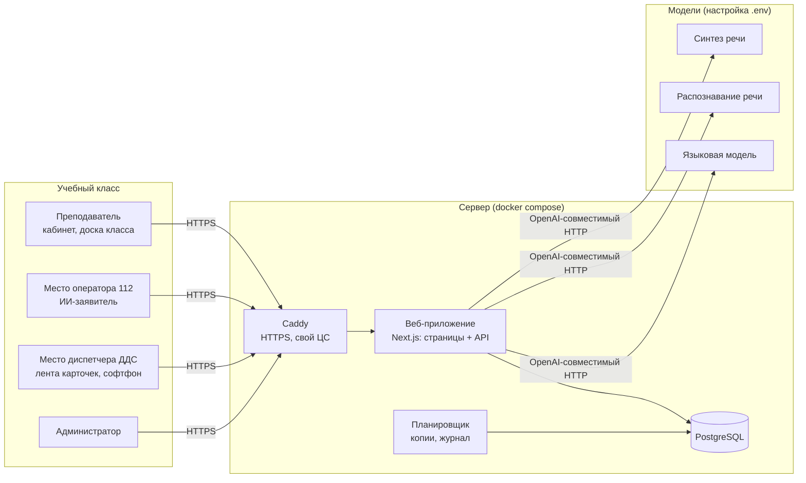
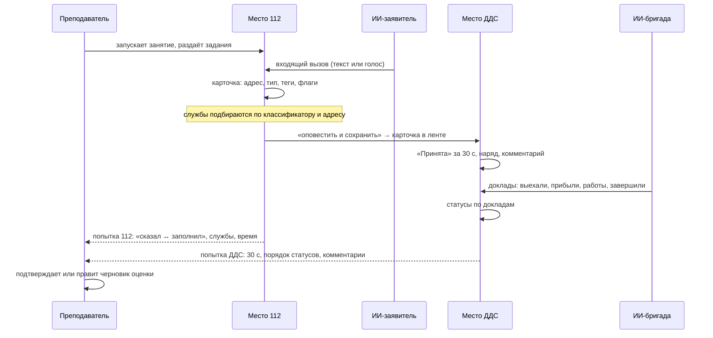

# Архитектура

## Компоненты

Одно веб-приложение обслуживает все роли. Рабочие места и доска класса опрашивают сервер раз в 1–2 секунды: без веб-сокетов, поэтому через любой прокси в контуре всё работает одинаково. Планировщик работает внутри процесса приложения: ежедневная резервная копия, ротация копий, срок хранения журнала.

Модели подключаются по OpenAI-совместимому HTTP API. Облако на стенде и локальные модели в контуре отличаются только строками в `.env`. Без модели система работает в режиме заглушки: заявитель отвечает по фактам сценария правилами.

## Функциональная схема занятия

## Данные

| Группа | Таблицы | Откуда |
|---|---|---|
| Пользователи и безопасность | User, Session, AuditLog, Group | администратор, преподаватель |
| Справочники заказчика | IncidentGroup, IncidentType (1283 типа), Route (21 743 правила), Service (211 служб + скрытые получатели) | классификатор v046_24 и v046_11, список «СЛУЖБЫ 112» — см. [data.md](data.md) |
| Учебное содержание | Scenario | 96 ситуаций из билетов, генерация ИИ, правка преподавателем |
| Занятие | Lesson, Seat, Incident, IncidentService, StatusEvent, Call | работа класса |
| Оценка | Attempt, WeightProfile | проверки правилами и ИИ, подтверждение преподавателем |
| Администрирование | SystemSetting, Backup | администратор, планировщик |

Бизнес-данные — нормативы, веса оценки, справочники, сценарии — лежат в базе, а не в коде. Преподаватель и администратор меняют их без программиста.

## Оценка

Каждая проверка возвращает результат одной из семи групп: время, порядок статусов, комментарии, адрес, тип и службы, полнота, понятность текста. Итоговый балл — взвешенная доля пройденных проверок. Проверки с ответом «не применимо» в знаменатель не входят, поэтому пустая попытка не получает 100 %. Критическая ошибка (например, улица-двойник) ограничивает балл 40 %. Сырые результаты проверок хранятся в попытке, поэтому смена весов мгновенно пересчитывает все попытки.

## Масштабирование

Приложение не хранит состояние в памяти: сессии, очередь карточек и таймеры — в базе. Для роста можно поставить несколько копий приложения за Caddy и вынести PostgreSQL на отдельный сервер. Замеры нагрузки — в [performance.md](performance.md).
