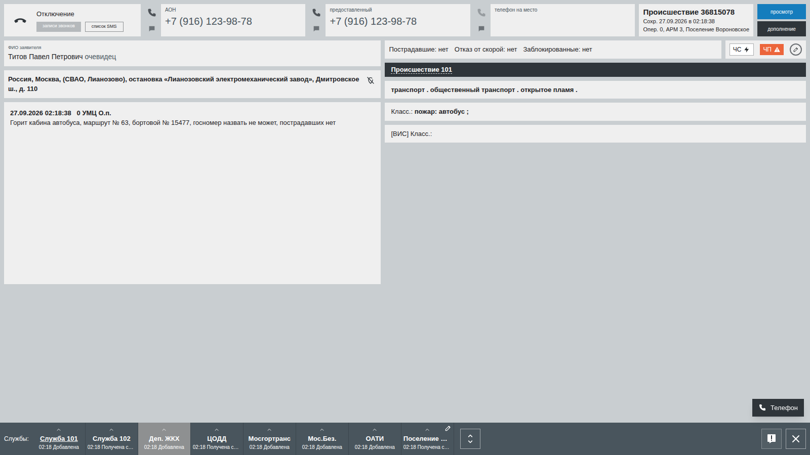
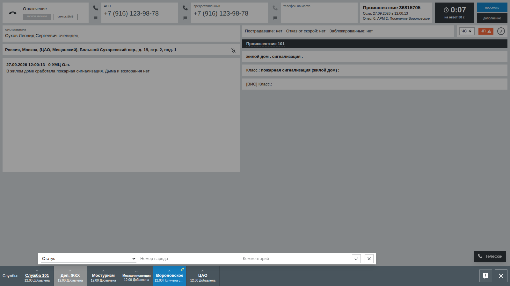

# Рабочее место диспетчера ДДС

Место ДДС повторяет АРМ-112 дежурно-диспетчерской службы со скриншотов заказчика: лента происшествий, карточка в режиме просмотра, полоса служб, окно статуса и синее окно истории. Диспетчер карточку не проверяет (требование заказчика) — он открывает её за 30 секунд, в течение 3 минут делает первую запись (статус и текст: «Принята» или «Не принята» с комментарием), отправляет наряд и ставит статусы по докладам бригады, которые приходят по телефону.

**Нормативы заказчика:** 30 секунд — от появления карточки в ленте («Добавлена») до её открытия; 3 минуты — от появления до первой записи: статус и непустой текст. Статус без текста запись не закрывает. Других временных норм у статусов нет: работы могут идти часами и днями. Отклоняя карточку, диспетчер пишет мотивированный отказ — почему не берёт и кому передано. Всё, что он сделал, сразу разбирается по нарушениям из памятки ДДС.

## 1. Как открыть

- Обучающийся входит и выбирает «Диспетчер ДДС» (адрес `/dds`).
- Если преподаватель запустил занятие и дал обучающемуся место с ролью ДДС и службой, лента сразу начинает получать карточки.
- Если занятия нет, на экране кнопка **«Тренировка без занятия»**: создаётся личное учебное занятие с местом «Поселение Вороновское» (профиль ДДС со скриншотов, билет Б30-3). Карточки приходят каждые 75 секунд, в очереди не больше двух, включены подсказки; все они — с адресами поселения Вороновское (раздел 4). Кнопка «Завершить тренировку» закрывает занятие и показывает разбор.
- Преподаватель и администратор могут открыть место обучающегося только для просмотра: `/dds?seat=<id места>` (преподаватель — только в своих занятиях).

## 2. Экран

**Лента** (`/dds`), как на скриншоте «Список происшествий»:

- шапка `#EBECEC` с полем «Поиск происшествий» (ищет по номеру, адресу, типу, описанию и статусу) и кнопкой «сбросить»;
- тёмный блок `#2F353A`: дата в формате заказчика («Четверг, 17 Сентябрь 2026»), служба и ФИО на месте, крупные часы с секундами; время везде московское; значок «?» рядом со службой открывает в новой вкладке памятку обучающегося (статусы, нормативы, телефон);
- тело `#838F97`: колонки Связи, закладка, ЧС, таймер, Опер. (бордовая ячейка `#6C364B`), АРМ, Номер, Дата, Время, Тип происшествия, Постр., Адрес, Статус службы; вторая строка «Описание» `#49555D`; новые сверху, 10 на странице, обновление раз в 1–1,5 секунды;
- **таймер** считает от «Добавлена» своей службы и краснеет (`#FF0000`), если карточку не открыли за 30 секунд. Норматив тикает у всех карточек в очереди сразу;
- **3 минуты на первую запись**: когда карточка открыта, тот же таймер с песочными часами показывает, сколько осталось до конца норматива первой записи (`workSec`, 3 минуты от «Добавлена» — норматив заказчика) — статуса с текстом. Время вышло — ячейка краснеет и показывает опоздание («+0:15»). После записи в ячейке — через сколько она сделана (красным — если с опозданием);
- «⌄» открывает предпросмотр: статусы других служб, заявитель, информация;
- «уведомления» — сколько карточек ждут ответа; при новой карточке звучит короткий сигнал.

**Карточка** (`/dds/incident/<номер>`), раздел B3 разбора материалов:

- верхняя полоса: «Отключение», АОН, предоставленный номер, телефон на место (трубка рядом с номером звонит заявителю; номер виден целиком и при идущем таймере — шрифт подстраивается под ширину поля, полный номер и в подсказке), «Происшествие N / Сохр. …», таймер своей службы (сколько осталось на первую запись — статус и текст; красный — опоздание), кнопки «просмотр» и «дополнение»;
- слева: ФИО и статус заявителя, адрес жирным и описательный адрес, журнал описаний;
- справа: «Пострадавшие / Отказ от скорой / Заблокированные», ЧС и ЧП, тёмная шапка «Происшествие 101», строка тегов через точку, «Класс.: … ;»;
- внизу полоса служб `#49555D`: плашки «название / ЧЧ:ММ последний статус» (у районных ДДС, которые в списке заказчика называются «Поселение …», общее слово не пишется — видно «Северное Бутово», «ЮЗАО»; полное название — в подсказке), серая плашка — служба оповещается только по телефону, главная служба подчёркнута, время последнего статуса красное, если он поставлен с опозданием. Если служб больше восьми, второй ряд открывается кнопкой ⇕ (сам, если своя плашка во втором ряду);
- **своя плашка** с карандашом ✎: по нажатию карточка затемняется и внизу появляется строка «Статус ▾ | Номер наряда | Комментарий | ✓ | ✕», сама плашка синяя `#157DBD`. Номер наряда подставляется из прошлого статуса, подсказки — наряды службы;
- «^» над любой плашкой открывает синее окно истории: `автор › дата время Статус › комментарий`; опоздавший ответ выделен красным. Автор технических статусов — «оп. 0», у внешних систем — «оп. 9999», у обучающегося — «Фамилия И О», как в памятке;
- «Получена службой» ставится сама, когда диспетчер впервые открывает карточку.

## 3. Статусы

| Сейчас | Можно поставить |
|---|---|
| Добавлена, Получена службой | Принята, Не принята |
| Не принята | только Принята |
| Принята | Начало реагирования, Прибытие, Проведение работ, Отказ от выполнения работ, Работы завершены |
| Начало реагирования / Прибытие / Проведение работ | следующие по ходу работ (промежуточные можно пропустить), Отказ, Работы завершены |
| Работы завершены, Отказ | ничего: карточка закрыта для службы, ошибку исправляет отдел контроля |

- Назад по статусам не ходят.
- Комментарий обязателен для «Не принята» и «Отказ» (причина и кому передано) и для «Работы завершены» (итоги — после сохранения карточка закрывается).
- **Служба 103** не ставит «Не принята» и «Отказ»: вместо них «Работы завершены» с комментарием «Завершение работ без бригады» — прямо с первого ответа.
- Открытие позже 30 секунд после «Добавлена» («Получена службой») и первая запись позже 3 минут записываются с отметкой опоздания — в окне истории время красное.
- Повторное нажатие или вторая вкладка не запишут статус дважды: статус меняется, только если его никто не изменил раньше.

Код: `src/lib/dds/status.ts` и тесты `status.test.ts`.

## 4. Как приходят карточки

Фоновых процессов нет: экран места раз в секунду опрашивает `/api/dds/state`, и этот опрос двигает поток (`src/lib/flow/dds-flow.ts`):

1. **Новая карточка** — если занятие идёт, у места открыто меньше `maxQueue` карточек и с прошлой прошло `tempoSec`. Первая приходит сразу. Сценарий: сначала задания, назначенные месту преподавателем, по порядку; иначе одобренный сценарий из категорий занятия — при адаптивной сложности рядом с уровнем ученика, иначе случайный. **Каждое задание и каждый сценарий приходят месту один раз за занятие** (считаются и карточки, пришедшие с мест 112). Когда новых нет, поток для места останавливается: вместо таймера следующей карточки место видит «Новых карточек пока нет: все задания этого места уже пришли», у преподавателя на доске — «Задания закончились» (`Seat.dealtOutAt`). Без заданий место берёт сначала сценарии, где в эталоне есть запись для его службы или его уровня (районная ДДС, префектура) — только там его решение и наряд оцениваются; затем те, что дошли бы до его службы по плашкам; затем любые. Билет и его вариант с ошибкой в карточке (Б4-1 и Б4-1-ош) показывают одну и ту же карточку, поэтому месту без заданий за занятие приходит только один из них (`src/lib/scenarios/pairs.ts`). Месту 112 варианты не раздаются вовсе: ошибка есть только в карточке, которую получает ДДС, а для оператора это тот же вызов, что и билет.
2. **Своя территория** (`src/lib/dds/territory.ts`). Карточка, которая пришла районной ДДС, поселению или префектуре, — на их территории: иначе тренажёр учил бы принимать чужие происшествия, а верный отказ («адрес в ЦАО, передано в ДДС Мещанского района») считался бы критичной ошибкой. Место без заданий берёт сначала сценарии, чей адрес уже в его районе (у префектуры — в округе); затем сценарии, у которых дом переносится: улица того же района из офлайн-справочника (`src/lib/op112/gazetteer.ts`; для префектуры — района её округа), дом рядом с известным по билетам (не сам билетный), подъезд, этаж, квартира и код сохраняются, объект и описательный адрес старого места убираются. Перенос детерминированный: один и тот же сценарий у одной и той же службы всегда ложится на один и тот же дом — это видят каждый опрос, наряд и заявитель при перезвоне — он называет новый адрес. Не переносятся и месту без заданий не выпадают вокзал, станция, парк, озеро, МКАД, частный дом, Московская область и описания, где названо место. Городские и ведомственные службы (Служба 101–104 и другие) адрес не меняют; карточки, набранные на местах 112, не переносятся — они маршрутизированы по реальному адресу. Улицы есть у всех районов и поселений списка служб, кроме трёх районов Зеленограда (Матушкино, Силино, Старое Крюково): им приходят только карточки их района.
3. **Плашки** берутся из карточки сценария. У перенесённой карточки плашки района и префектуры — по новому адресу. Своя служба места есть всегда (#684, один алгоритм для всех ДДС): если места нет в карточке, районная ДДС или ДДС префектуры встаёт на место плашки своего уровня и получает её эталон; остальные службы добавляются в конец. Если записи своего уровня в эталоне нет, решение и наряд места не оцениваются («не применимо»): отсутствие записи — не повод требовать «Принята» и наряд. Нормативы (открыть карточку за 30 секунд, первая запись за 3 минуты) и комментарии оцениваются всегда. **Чужая карточка** — задание, отмеченное вручную, которое перенести нельзя, или карточка с места 112 с адресом другого района — оставляет свои плашки, своя служба добавляется в конец, а эталон места — «Не принята» с мотивированным отказом: чья территория и кому передано.
4. **Карточки, сохранённые на местах 112** того же занятия, тоже приходят в ленту, если среди их плашек есть служба места и занятие берёт карточки учеников (источник «сформированные учениками» или «смешанные»). В занятии «сгенерированные» они остаются на местах 112, как и на доске класса. В **смешанном** занятии ситуация, которая звонит, набрана или назначена заданием на месте 112, месту ДДС сгенерированной карточкой не приходит — даже если она у места ДДС в заданиях: она придёт с места 112, если в карточке будет служба места. Место 112 без заданий не звонит с ситуацией, уже сгенерированной месту ДДС. В занятии «сгенерированные» это лишь предпочтение: занятую ситуацию место получит, если больше нечего.
5. **Чужие плашки живые**: внешние системы получают карточку за секунды, службы на АРМ — когда «их диспетчер» откроет; дальше «Принята» с номером наряда, выезд, прибытие, работы, «Работы завершены» с комментариями. Серые плашки (только телефон) статусов не получают. Расписание у каждой плашки своё, но одинаковое при каждом опросе (`src/lib/dds/bots.ts`).

Настройки занятия (`Lesson.settings`): `tempoSec`, `maxQueue`, `ackSec` («Открыть карточку», 30 с), `workSec` («Первая запись — статус и текст», 3 мин; нормативы заказчика), `cardSource`, `categories`, `brigadeReports`, `hints`; `practice` отмечает самостоятельную тренировку.

## 5. Телефон

Софтфон открывается кнопкой «Телефон» справа внизу и сам всплывает при входящем звонке. В заголовке переключатель «Голос / Текст», как на месте 112: в режиме «Голос» реплики собеседника звучат мужским или женским голосом персонажа, а заголовок — «Расшифровка разговора»; в режиме «Текст» реплики только на экране. Кнопка «Удерживайте, чтобы говорить» (или пробел) сама включает «Голос», набор текста в поле — «Текст». По умолчанию «Голос», если можно говорить голосом, иначе «Текст». Всё сказанное пишется в `Call.messages`.

- **Наряд назначается** номером наряда в статусе («Принята», наряд 23) или по телефону: позвонить свободному наряду из книжки и сказать, куда ехать. У каждой службы три наряда со старшими (`src/lib/dds/personas.ts`).
- **Доклады (#691, вариант «а»)**: после назначения наряд проходит этапы из эталона сценария — выехали, прибыли, начали работы, закончили (или «работы проводить не будем») — примерно за 3 минуты после отправки. Это темп учебной бригады (`CREW_PACE_SEC`), а не норматив: у статусов своих временных норм нет. О времени старший говорит в этом темпе — «скоро будем», «скоро закончим», а на «во сколько прибыли?» называет время этапов по часам. На каждом этапе старший звонит сам; звонок звонит 25 секунд и, если не ответить, становится пропущенным.
- **Звонок наряду (вариант «б»)**: диспетчер сам звонит старшему и спрашивает ход работ — тот докладывает, где наряд сейчас. Если доклад был пропущен, старший, взяв трубку, сразу докладывает пропущенное.
- **Перезвон заявителю (#739–740)**: трубка у номера в карточке или книжка. Заявитель отвечает только по фактам сценария; номер карточки он не знает, и если диспетчер его назовёт, это попадёт в разбор.
- **Другие службы карточки и организации из эталона** (управляющая компания, «Ростелеком») — из книжки; у служб без номера в справочнике учебный номер (101–104 — короткие).
- **112** — звонок по памятке, когда обстановка изменилась: оператор просит представиться, назвать адрес, номер карточки и что изменилось. «Служба 112» — первая строка «Книжки».
- **Ошибка в карточке → бригада → звонок в 112** (ответ заказчика 27.09): об ошибке в карточке диспетчер обычно узнаёт от бригады, которая выехала на место, и сообщает о ней по телефону в 112; сам он вправе править только те поля, которые заполняет (статус, наряд, комментарий). В трёх утверждённых вариантах билетов (`data/scenarios-card-errors.json`: Б2-1 — не тот подъезд, Б4-1 — «пострадавших нет», а на месте пострадавший, Б5-1 — не тот корпус) старший наряда при докладе о прибытии называет расхождение; если этот доклад пропущен — в следующем докладе и сразу при перезвоне, а на вопросы про адрес, подъезд, корпус, пострадавших отвечает, как на месте. Оператор 112 просит номер карточки и верные сведения; когда они названы, он исправляет карточку: поля по `fix` (подъезд, корпус, «Пострадавшие») и запись в журнале описаний «Изменено оператором 112 по звонку диспетчера …; в карточке было …» — её видят все службы карточки (`src/lib/dds/card-fix.ts`). Пока карточка не исправлена, оператор не говорит «исправил» или «оповестил» — такая реплика модели заменяется правилом. Сценарий задаёт это полем `ddsReference.cardError` (`what`, `inCard`, `onSite`, `report`, `mustSay` — образцы верных сведений, `fix` — что исправить в карточке).
- **Удержание**: кнопка «Удержание» в разговоре ставит собеседника на ожидание — он ждёт на линии, а линия свободна: можно принять доклад наряда («Удержать и ответить» у входящего звонка) или позвонить в другую службу. Жёлтая полоса «на удержании 0:45» показывает, сколько собеседник ждёт; «Снять с удержания» возвращает к нему (идущий в этот момент разговор сам встаёт на удержание), и собеседник отвечает, что он на линии. Звонок на удержании можно и положить; собеседник ждёт не дольше 3 минут, потом кладёт трубку сам (это видно в журнале). Наряд, чей доклад на удержании, не звонит повторно; в конце занятия такие звонки завершаются вместе с периодом удержания. Звонки, которые ещё идут, телефон показывает всегда, даже если после них было больше 40 звонков. Время удержания хранится в `Call.holds`, статус звонка — `HELD`.
- **Журнал** — все звонки с расшифровкой, пропущенные красным; у звонка с удержанием — «удержание 0:45», а в расшифровке — отметка, где разговор ждал. Кнопка с трубкой у звонка перезванивает (наряду — по его телефону или номеру наряда, по той же карточке). Набранный на клавиатуре номер после звонка стирается.

Без адреса языковой модели (`LLM_BASE_URL`) собеседники отвечают детерминированно по фактам сценария; с моделью — по коротким промптам из `personas.ts`, а при ошибке модели всё равно звучит заготовленная реплика.

## 6. Разбор

Плашка разбирается, когда получила «Не принята», «Работы завершены» или «Отказ», и ещё раз в конце занятия (карточки без ответа тоже). Плашку, на которую ответила система, разбирают, только если место с ней работало, — так же её считает доска класса. Результат — `Attempt` с `kind = DDS`: список проверок с доказательствами (время, цитаты) и балл по активному профилю весов. Проверенный преподавателем разбор больше не перезаписывается.

| Проверка | Группа весов | Что ловит (памятка ДДС, D4) |
|---|---|---|
| Карточка открыта за 30 с | время | открыли позже 30 секунд после «Добавлена»; не открыли вовсе — критично («Не оповещено»). Доказательство: когда появилась и когда открыта |
| Первая запись — статус и текст — за 3 мин | время | первая запись позже 3 минут; статус без текста запись не закрывает; записи нет вовсе — критично. Доказательство: когда появилась, открыта, первая запись и её текст |
| Звонки наряда приняты | время | пропущенные доклады |
| В «Не принята» / «Отказ» указана причина | комментарии | пустая отговорка |
| Указано, кому передана информация | комментарии | нет организации, «передано», «дубль», «КП №» |
| Итоговый комментарий содержательный | комментарии | «Работы завершены» без итогов |
| В комментарии есть то, что требует эталон | комментарии | не хватает пунктов `commentMustHave` (сверка по основам слов; «кто направлен», «кто выезжал» закрывает названная организация, бригада или представитель — «сотрудник ГБУ «Жилищник»»; ошибка, если не хватает хотя бы одного — вердикт совпадает с доказательством) |
| Статусы хода работ проставлены | порядок статусов | сразу «Принята → Работы завершены», хотя бригада выезжала |
| Статусы ставятся по факту | порядок статусов | «Прибытие» или «Работы завершены» раньше доклада |
| Статус соответствует смыслу | порядок статусов | «Принята: не обслуживаем», «Работы завершены: нет договора» |
| Карточка закрыта правильным статусом | порядок статусов | «Работы завершены» там, где по эталону «Отказ» |
| Решение совпадает с эталоном | службы | отказ от профильного происшествия — критично; «не применимо», если эталон решения для этой службы не задаёт; для чужой карточки районной ДДС или префектуры эталон — «Не принята» (раздел 4) |
| Перезвон без номера карточки | полнота | номер карточки назван заявителю |
| Об ошибке в карточке сообщено в 112 | полнота | в каждом сценарии с ошибкой в карточке; засчитывается по факту звонка в 112 (из карточки, из ленты, с набора) с номером карточки и верными сведениями. Ошибка — наряд доехал до места (доложил или, по темпу, звонил, а доклад пропущен), а звонка нет или в нём не хватает номера или сведений; «не применимо» — пока об ошибке некому было узнать. Доказательство: когда наряд доложил, время звонка и цитата |
| Итоги — по верным сведениям | комментарии | итоговый комментарий повторяет ошибку карточки вместо того, как на самом деле |
| Итоговый комментарий по шаблону занятия | комментарии | только если преподаватель задал шаблон и только у «Работы завершены» (не у отказа): «Наряд № {номер} направлен…» не соблюдён — показан образец |
| Комментарии понятны следующему диспетчеру | понятность текста | правила по комментариям к «Не принята» / «Отказу» и итоговому: слишком коротко, не сказано, чем закончилось, свои сокращения («АБ», «бриг.»), английская раскладка |
| ИИ: комментарии понятны следующему диспетчеру | понятность текста | модель: неясные «туда», «он», пропущенный итог; цитата и как написать лучше. Идёт в фоне, учитывает правки преподавателя; без модели — «не применимо». В сценарии с ошибкой в карточке модель знает, что сведения с места верные; если она всё же называет их непонятными, её вердикт не учитывается |

Статусы хода работ ставятся по докладам бригады без срока: пропущенный статус ловит «Статусы хода работ проставлены», поставленный раньше доклада — «Статусы ставятся по факту». Проверка, которая к карточке не относится, получает «не применимо» и не входит в балл: карточка, где проверять нечего, не получает 100 %. При провале критичной проверки балл не выше 40. Код: `src/lib/dds/evaluate.ts` (правила и тесты), `src/lib/dds/review.ts` (сбор фактов и запись), понятность текста — `clarity.ts` (правила) и `clarity-ai.ts` (модель).

Понятность проверяется двумя способами. Правила дают одинаковый вердикт на одинаковый текст и работают всегда; общепринятые сокращения (ДДС, МЧС, ЦЭМП, ОАТИ, ГБУ, ЦОДД, ЖКХ, округа) и слова с плашек служб ошибкой не считаются, опечатки — тоже. Модель, если подключена, читает те же комментарии после сохранения статуса, в фоне, и не задерживает диспетчера; тот же текст второй раз не отправляется. Правки преподавателя по этой проверке модель учитывает в похожих случаях — подробно в [methods.md](methods.md), раздел 4.

Обучающийся видит разбор на своём месте: во время самостоятельной тренировки — сразу, на занятии — после его завершения («Разбор»: балл, ошибки, доказательства и «как правильно»).

## 7. Что берётся из сценария

Сценарий в формате `data/scenarios.json`:

- `ddsCard`: `classLabel` → «Класс.», `tagsLine` → строка тегов, `flags` (в том числе «Заблокированные»), `address` и `descriptive`, `description`, `caller`, `services` (имена плашек); `truth.kind` → «Происшествие 101», `truth.address` и `truth.services` — адрес и плашки с номерами служб.
- `ddsReference.services[]` для службы места (или для её роли): `decision` (ACCEPTED / REJECTED), `decisionComment`, `chain` (этапы бригады), `brigadeReport` (итоговый доклад), `commentMustHave`, `traps`.
- Необязательные поля, которые понимает место ДДС: `contacts` — номера организаций для книжки, `transferTo` — слова «кому передано» для проверки, `crew.work` и `crew.refuse` — что говорит бригада на месте и почему отказывается.

Для разработки есть четыре дополнительных сценария Вороновского (пожар в квартире, лифт у подрядчика, прорыв трубы, провод «Ростелекома»): `pnpm exec tsx prisma/dev-fixtures-dds.ts` после `pnpm db:seed`.

## 8. Для других частей системы

- API места: `GET /api/dds/state` (опрос и поток), `GET /api/dds/feed`, `GET /api/dds/incidents/<номер>`, `POST /api/dds/incidents/<номер>/status`, `POST /api/dds/calls`, `POST /api/dds/calls/<id>/answer | say | hold | resume | hangup`, `POST /api/dds/practice`, `POST /api/dds/practice/finish`, `GET /api/dds/results`. Каждый маршрут проверяет вход; обучающийся видит только своё место и свои карточки, запись — только на своём месте в идущем занятии.
- Кнопка преподавателя «Завершить занятие» должна вызвать `finishLessonEvaluation(lessonId)` из `src/lib/dds/review.ts` (вызов можно повторять). Если не вызовет, разбор всё равно появится, когда обучающийся откроет место.
- Сгенерированная карточка знает своё место: `Incident.ddsSeatId`. Что видит место — `seatFeedWhere(seat)` из `src/lib/dds/scope.ts`.
- Карточка с места 112 попадает к ДДС, когда её `status` не `draft`, среди плашек есть служба места и занятие берёт карточки учеников (`cardSource` — `students` или `mixed`). Если на занятии несколько мест ДДС с одной службой, карточку 112 видят все они и работают с одной плашкой — местам ДДС лучше давать разные службы.
