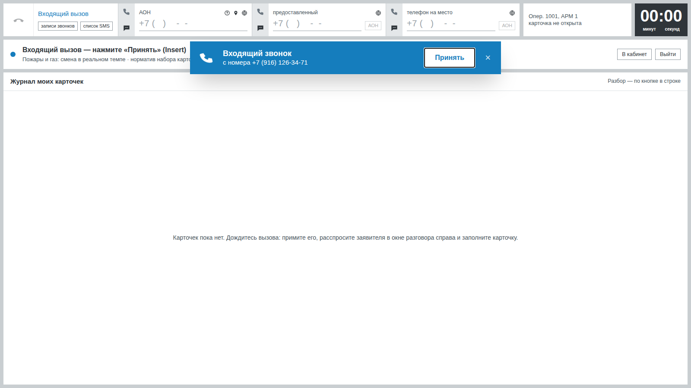

# Рабочее место оператора 112

Место 112 — учебная копия АРМ «Приём и обработка вызовов 112» по скриншотам заказчика. Обучающийся принимает вызов от ИИ-заявителя, расспрашивает его, заполняет карточку происшествия и оповещает службы. Сохранённая карточка сразу приходит на места диспетчеров ДДС того же занятия. После «отработана» в «Тренировке без занятия» система сразу показывает разбор — самопроверку: совпадает ли то, что сказал заявитель, с тем, что записано в карточке, и верно ли выбраны службы. На занятии разбор — черновик для преподавателя: ученик видит «Разбор появится после проверки преподавателем», а балл и разбор — в «Моих результатах» после проверки.

Адрес: `/op112`. Открыть может обучающийся, преподаватель и администратор; каждый видит только свои вызовы и карточки. Место рассчитано на экран компьютера: на телефоне и в окне уже 1024 пикселей вместо наложенных друг на друга блоков показывается сообщение «Рабочее место рассчитано на экран компьютера» с кнопками «В кабинет» и «Всё равно открыть».

## Как проходит вызов

1. **Ожидание.** Статус телефонии «Доступен», внизу журнал своих карточек с кнопкой «разбор»: в тренировке — с баллом самопроверки, на занятии — «после проверки». В журнале только оценки этого места: плашки той же карточки у мест ДДС оцениваются отдельно.
2. **Входящий звонок.** Через несколько секунд всплывает синяя полоса «Входящий звонок с номера … [Принять]» и звучит сигнал. Принять можно кнопкой, Enter или Insert.
3. **Карточка.** Открывается новая карточка «Происшествие N», таймер набора считает вверх и краснеет после норматива занятия (по умолчанию 65 с). АОН подставляется сам, канал связи определяется по номеру. Черновик сохраняется сам каждую секунду («Сохр.» в шапке), поэтому перезагрузка страницы ничего не теряет.
4. **Разговор.** Справа панель «Разговор с заявителем»: вопрос можно напечатать (Enter — сказать), выбрать из готовых фраз или сказать голосом (кнопка «Удерживайте, чтобы говорить» или пробел). Над разговором переключатель «Голос / Текст». В режиме «Голос» реплики заявителя звучат вслух, а панель называется «Расшифровка разговора»; в режиме «Текст» реплики только на экране и не озвучиваются — ни сразу, ни позже. Кнопка «Удерживайте, чтобы говорить» или пробел сами включают «Голос», набор текста в поле — «Текст»; пока заявитель говорит, на кнопке — «Собеседник говорит». По умолчанию «Голос», если можно говорить голосом (есть сервер распознавания или распознавание в браузере), иначе «Текст»; выбор запоминается в браузере. Так же устроены звонки в службы из отработки. В учебном режиме под разговором видно, о чём уже спросили: адрес, пострадавшие, газ, этажность и т. д.
5. **Заполнение.** Блоки заполняются в любом порядке, как на АРМ:
   - заявитель: фамилия и имя (заглавные буквы ставятся сами), статус из 6 значений, канал связи, «вызов на иностранном языке»;
   - адрес: одна строка поиска с подсказками, поля заполняются сами, район и округ определяются сами; «очистить адрес» стирает всё;
   - описание со слов заявителя: счётчик 0 / 1999 и подсказка, что в службу 103 уходят первые 100 символов;
   - флаги «Пострадавшие», «Нет на месте / Отказ от скорой», «Нет доступа / Заблокированные»;
   - «что случилось?»: поиск по 51 типу с синонимами («пожар» находит 101, «приступ» и «медицина» — 103), частые кнопки, значимые типы; можно выбрать несколько типов. Поиск идёт и по всему классификатору: если слово есть в листе, его признаках или названии группы, в списке появляется тип этого листа с подсказкой — «судороги» → «103 — Судороги», «мусоропровод» → 101. Окончания не мешают: длинное слово ищется по основе («судорогами», «медицинской»);
   - опросная карта: открывается только после заполнения адреса (улица, объект или описательный адрес), как в инструкции: «После заполнения формы «Адрес» становится доступной экранная форма с дополнительными вопросами». До этого под выбранным типом — подсказка «Опросная карта откроется после заполнения адреса» и кнопка «к адресу (Alt+A)». Строки появляются по мере ответов, выбранная кнопка синяя. Под типами показан итоговый «Класс.».
6. **Службы.** Оранжевая полоса «Службы:» собирается сама по классификатору, как только выбран тип и признаки; главная служба первая и подчёркнута. «+» открывает окно «Добавьте службы» (поиск по 211 службам, подобранные системой синие). Добавленную вручную службу можно убрать, подобранную системой — нельзя.
7. **Сохранение.** «сохранить» открывает окно «Список оповещаемых служб» с предупреждениями о незаполненных полях (как в оригинале, они не блокируют). «оповестить и сохранить карточку» регистрирует карточку, полоса служб темнеет, у плашек появляется «ЧЧ:ММ Добавлена», кнопка меняется на «отработана». Разговор на этом заканчивается, внизу открываются «Отработки».
8. **Отработки.** Службам, которые система не оповещает сама, оператор звонит из строки отработки и записывает звонок (подробно — ниже).
9. **Разбор.** «отработана» закрывает карточку и открывает разбор. Следующий вызов приходит только после этого.

«нет контакта» и «срыв звонка» работают, пока тип не выбран: окно «Сохранить карточку как пустую?» и пустая карточка без служб. В журнале она видна как «<Нет контакта>» или «<Срыв связи>».

## Тишина на линии и срыв звонка

Инструкция оператора: «Для быстрой обработки нерезультативных вызовов предусмотрены кнопки: «Нет контакта» при отсутствии контакта с заявителем, «Срыв звонка», если звонок сорвался». Пустая карточка сразу получает статус «Завершена» и службы не оповещает. В билетах заказчика заявитель всегда говорит, поэтому для этих кнопок есть три отдельных задания, составленных по инструкции (`scripts/instruction-scenarios.ts`, категория «тишина и срыв звонка», утверждены, только для места 112 — на места ДДС не попадают):

| Задание | Что на линии | Верное действие |
|---|---|---|
| НВ-1. Тишина на линии | в чате «…тишина, в трубке только шум…» на каждую реплику; после четвёртой попытки — «…короткие гудки…» | окликнуть абонента («Служба 112, говорите, вас не слышно»), затем «нет контакта» → «сохранить карточку как пустую» |
| НВ-2. Звонок сорвался на первой фразе | «Алло! Алло, это сто двенадцать? Тут у нас…», на первый вопрос — обрыв и гудки | «срыв звонка» → «сохранить карточку как пустую» |
| НВ-3. Горит машина во дворе, связь прервалась | заявитель успевает сказать, что горит и где; на повторный вопрос об адресе (или на третью реплику оператора) связь обрывается | вызов результативный: завести карточку по сказанному и оповестить службы, кнопку не нажимать |

Поведение линии задаёт сценарий (`Scenario.caller.line = silent | drops`, `dropAfter`, `opening`, `dropLine`) и разыгрывают правила (`lineTurn` в `src/lib/op112/caller.ts`), поэтому с моделью и без неё задание идёт одинаково: модель в тишину и в обрыв не вмешивается. Тишина и гудки в разговоре выделены курсивом и не озвучиваются. После обрыва разговор закрыт, карточка остаётся открытой.

Проверки разбора:

| Проверка | Когда | Что значит |
|---|---|---|
| «Нерезультативный вызов закрыт кнопкой «…»» | пустой вызов закрыт кнопкой | нажата та кнопка, что в эталоне; другая из двух — обычная ошибка |
| «Прежде чем закрыть вызов, оператор окликнул абонента» | тишина на линии | до кнопки была хотя бы одна реплика оператора. Этого нет в инструкции — это правило приёма вызова, его можно снять правкой преподавателя |
| «Пустая карточка закрыта за м:сс» | пустой вызов | время от «Принять» до кнопки не больше норматива набора занятия (таймер не покраснел) |
| «По пустому вызову не заведена карточка со службами» | по пустому вызову сохранена обычная карточка | **критично**: службы получили бы вызов, которого не было |
| «Карточка не сохранена пустой по ошибке» | кнопка нажата, хотя заявитель говорил | **критично**; в доказательстве — что заявитель успел сообщить (что случилось, адрес) |
| «Сорвавшийся вызов с данными оформлен карточкой, а не пустой» | обрыв после адреса, карточка заведена | засчитывается; фамилия и телефон, которые заявитель не успел назвать, — «не применимо», а не ошибка |

## Отработки и службы, работающие по телефону

Памятка о способах оповещения: «Телефонная связь – у службы нет возможности осуществить интеграцию или установить АРМ-112, информация о происшествиях передается в службу только по телефону». Такая служба в справочнике помечена `Service.delivery = PHONE` и в полосе служб серая (сейчас это «Деп. ЖКХ»; она есть в карточках большинства пожаров). Инструкция: «После сохранения карточки становится доступной кнопка «Добавить отработку». Эта функция предназначена для регистрации звонков в службы, которые не оповещены автоматически».

Как это устроено:

- после «сохранить» внизу карточки блок «Отработки» (Alt+O): сверху — службы «только по телефону» и их состояние («не оповещена», «отработка не записана», «оповещена»), ниже — журнал и строка ввода «служба ▾ | куда звонили | телефон | кто принял | суть сообщения | трубка | галочка». Служба выбирается только из справочника (сначала службы карточки), телефон подставляется из справочника (учебный номер), галочка или Enter сохраняет строку, если заполнено хоть одно поле;
- трубка в строке, кнопка службы в блоке или трубка на серой плашке звонят в службу. Справа открывается разговор «Звонок: Деп. ЖКХ» (вкладки переключают его и разговор с заявителем). Дежурный отвечает: «Департамент ЖКХ, дежурный Морозов, слушаю.» и принимает карточку, когда оператор назвал **номер карточки, адрес и что случилось**; иначе спрашивает недостающее. Приём решают правила (`src/lib/op112/duty.ts`), модель, если настроена, только формулирует реплики — без модели реплики строят те же правила;
- после разговора оператор записывает в строку, кто принял (фамилия дежурного) и суть, и сохраняет строку;
- «отработана», пока служба «только по телефону» не оповещена или звонок не записан, показывает окно «Не все службы оповещены по телефону» с выбором «вернуться к отработкам» или «отработана без звонка». Инструкция блокировок не описывает, поэтому это предупреждение, а не запрет.

Журнал хранится в `Incident.workLog` (миграция `20260927060000_incident_work_log`), звонки — в `Call` с `kind = SERVICE_OUT`; преподаватель видит их в попытке рядом с разговором с заявителем. До «сохранить» трубка на плашке по инструкции переводит заявителя в службу — в учебной версии перевод не используется, об этом говорит подсказка.

Проверка разбора «Все службы, работающие по телефону, оповещены» считается при «отработана» (до этого — «не применимо»): для каждой серой плашки нужен звонок, где дежурный принял карточку, и строка отработки этой службы, где в «кто принял» записан тот, кто ответил. Доказательство — время звонка, цитата дежурного и строка журнала: «Деп. ЖКХ: звонок 12:03, дежурный Морозов: «Принято, передаю бригаде…»; в отработке: кто принял — Морозов, суть — «Принято, передано бригаде»». Иначе — что именно не так: не звонили, карточку не приняли, отработка не записана, не записано или записано не то имя.

## «Совпадение» и связи карточек

Инструкция: «При заведении карточки система может сообщить, что карточка с таким же номером заявителя или местом происшествия уже была добавлена в систему недавно. При этом появляется кнопка «Совпадение»» и «После нажатия на кнопку «Привязать» текущая карточка станет связанной с выбранной карточкой». Карточка, к которой привязывают, — главная, из которой привязывают, — подчинённая; две цепочки соединяются через главные, поэтому связь всегда ведёт к главной карточке.

Как это устроено:

- пока карточка заполняется, место 112 ищет среди сохранённых карточек своего занятия (любого места 112) совпадение по номеру (АОН, предоставленный, на место — по последним 10 цифрам) и по месту (та же улица и тот же дом, если он указан у обеих). Совпадение по номеру даёт оранжевую кнопку «⚠ совпадение» в блоке АОН, по месту — в блоке адреса;
- кнопка открывает окно «Есть карточка с заявителем по этому номеру:» / «Есть карточка по этому адресу:» — номер, время, адрес, тип, оператор и «привязать»; «закрыть и продолжить заполнение новой» закрывает окно;
- «создать связь» (Alt+W, цепочка в нижней полосе) — окно поиска по сохранённым карточкам занятия (номер, улица, тип): Alt+1 — поиск, Alt+2 — список, Alt+3 — возврат; там же «отвязать». Работает и при создании, и в сохранённой карточке, как в инструкции;
- связанная карточка показывает «связана с № N» у номера и подсвеченную цепочку; в ленте ДДС в колонке «Связи» у подчинённой карточки значок цепочки с номером главной в подсказке.

Связь хранится в `Incident.linkedToId` (миграция `20260927070000_incident_links`), API — `POST /api/op112/incidents/[id]/matches` и `GET|POST /api/op112/incidents/[id]/link`, правила — `src/lib/op112/links.ts`, `links-db.ts`.

Задание ПВ-1 «Повторный вызов: горит балкон на ул. Грина» (`scripts/instruction-scenarios.ts`, утверждено, только для места 112): сосед из дома напротив звонит о том же пожаре, что и билет Б4-1, и сразу называет «улица Грина, дом 11». Эталон карточки — как у Б4-1 (`truth.repeatOf = "Б4-1"`). Звонит только когда в занятии уже есть сохранённая карточка по Б4-1 (на любом месте 112), иначе привязывать не к чему (`src/lib/op112/seat.ts`).

Проверка разбора «Повторный вызов привязан к карточке первого вызова»: карточка связана с карточкой занятия по исходному билету — «Привязана к карточке № N (ул. Грина, д. 11 …) — дубля нет»; иначе — «Не привязана: в занятии уже есть карточка № N … — службы получили её дубль» с подсказкой, что нажать. Для обычного вызова лишняя связь — ошибка «Нет лишней связи с другой карточкой». Обе проверки пересчитываются при «отработана»: связь можно поставить и в сохранённой карточке.

## Сохранённая карточка: просмотр и дополнение

После «оповестить и сохранить карточку» экран переходит в режим просмотра, как на АРМ: справа вверху кнопки «просмотр» и «дополнение», вместо формы адреса — одна строка «Россия, Москва, (СЗАО, Щукино), улица Рогова, 12», у номера карточки — «Зарег …», внизу «Отработки».

«дополнение» (Shift+F2) — по инструкции: «станут доступными для внесения информации поля, в которых не была зарегистрирована информация до сохранения карточки, а также поле «Описание со слов заявителя»»; признак «Пострадавшие» тоже можно поменять («Возможно изменять признак наличия пострадавших после сохранения карточки»). Заполненные при сохранении поля (в том числе ФИО и статус) остаются закрытыми. «сохранить» (Alt+S) записывает дополнение в карточку и строкой «оп. N, дополнение» в журнал описаний, который читает место ДДС: дописанный текст описания, «Дополнено: подъезд: 3, этаж: 5», «Пострадавшие: есть». «просмотр» (Shift+F1) выходит из дополнения без сохранения. Правило — `src/lib/op112/supplement.ts`, API — `POST /api/op112/incidents/[id]/supplement`. Разбор карточки дополнение не меняет: карточка оценивается такой, какой ушла в службы.

## Горячие клавиши

Зажмите Alt — рядом с блоками появятся подсказки. Клавиши работают при любой раскладке. Значок «?» у номера АОН открывает в новой вкладке памятку обучающегося с этим списком; её таблица сверяется с обработчиком клавиш автотестом (`src/lib/help/op112-keys.test.ts`). Как в таблице инструкции, часть клавиш при создании карточки и в режиме просмотра значит разное.

| Клавиши | При создании карточки | В сохранённой карточке (режим просмотра) |
|---|---|---|
| Insert, Enter | принять входящий вызов | |
| Alt+F1 / F2 / F3 | телефоны: АОН / предоставленный / на место | |
| Alt+Q | фамилия и имя заявителя | |
| Alt+K | канал связи | |
| Alt+A | строка адреса | |
| Alt+P | флаг «Пострадавшие» | флаг «Пострадавшие» в дополнении |
| Alt+N | к кнопкам «нет контакта» / «срыв звонка» (пока тип не выбран) | «Вернуть на доработку» — только в статусе «Проверена», иначе подсказка |
| Alt+T | «что случилось?» | |
| Alt+R | значимые типы происшествий | |
| Alt+1…9 | n-я опросная карта | |
| Alt+Ctrl+1…9 | n-я строка текущей опросной карты | |
| Alt+O | описание со слов заявителя | блок отработок (в дополнении — описание) |
| Alt+Z | окно «Добавьте службы» | |
| Alt+S | сохранить → оповестить и сохранить | «отработана»; в дополнении — «сохранить» |
| Alt+V | важное происшествие | важное происшествие |
| Alt+W | создать связь (окно поиска карточек занятия) | создать связь |
| Alt+Y | | «Проверена» — только в статусе «Проверена», иначе подсказка |
| Shift+F1 | | меню «Просмотр» (выйти из дополнения без сохранения) |
| Shift+F2 | | меню «Дополнить» |
| Alt+J | поле разговора | поле разговора |
| Esc | закрыть окно | закрыть окно |

«Проверена» и «Вернуть на доработку» инструкция относит к карточке в статусе «Проверена»; у оператора 112 после сохранения карточка «Зарегистрирована», поэтому Alt+Y и Alt+N здесь объясняют это подсказкой (при зажатом Alt они подписаны у номера карточки). В окне связи Alt+1 / Alt+2 / Alt+3 — поиск, список, возврат. Alt+B и Alt+M (напоминание, сообщение о проблеме) в учебной версии показывают подсказку. Alt+F1 и Alt+F2 в некоторых рабочих столах Linux забирает сама система — там к телефонам удобнее переходить мышью.

## ИИ-заявитель

Заявитель — человек из учебного билета: ФИО, роль (очевидец, мама, сосед…), телефон, что случилось, адрес, как он его называет, и «скрытый» адрес, который выясняется только при уточнении, плюс факты билета («Дом 14 этажей, газифицирован»). Сценарии берутся из одобренных (`Scenario.status = APPROVED`): если преподаватель назначил месту свои задания, звонят по ним, иначе по одобренным сценариям категорий занятия; сначала те, что ещё не звонили, от лёгких к трудным.

Правила заявителя:

- сняв трубку, говорит только короткое «Алло…» по характеру («Алло, здравствуйте…», в панике «Алло! Алло, это 112?!») и ждёт; что случилось — рассказывает в ответ на приветствие или первый вопрос оператора, а если оператор сразу спросил о другом, всё равно начинает с беды. Так рассказ не звучит дважды;
- сказанное не пересказывает слово в слово: на повторный вопрос отвечает коротко («Я же говорю — горит балкон на тринадцатом этаже!») или добавляет то, чего ещё не говорил; адрес, имя и телефон по просьбе повторяет («Повторяю: …»);
- говорит живо и разговорно: короткие фразы, эмоции, без книжных оборотов и канцелярита;
- называет адрес так, как в билете; точный адрес — только на уточняющий вопрос («какой номер дома?», «где именно?», повторный вопрос об адресе);
- факты (этажность, газ, доступ, пострадавшие, оружие…) — только если о них спросили; чего в билете нет — «не знаю»;
- манера по характеру: спокойный, в панике («Помогите!» в рассказе, дальше «Быстрее!» через реплику, не в каждой), пожилой («Ой…» один раз после рассказа), ребёнок, раздражённый. «Сынок» / «дочка» у пожилого и «дядя» / «тётя» у ребёнка — только по полу оператора (по отчеству в учётной записи); если пол не понятен, без обращения. То же правило получает и модель;
- заметки билета для преподавателя («сообщает только на вопрос», «при уточнении — дом 11») не произносит, сокращения говорит словами, как их произносят вслух: «ул. Грина, д. 11, кв. 5» → «улица Грина, дом 11, квартира 5», «на ул. Грина» → «на улице Грина», «д. Истомиха» → «деревня Истомиха», «м. Отрадное» → «метро Отрадное», «50 м» → «50 метров», «МКАД, 73 км» → «МКАД, 73-й километр», «03 не требуется» → «скорая не нужна», «а/м» → «машина», «д/р» → «дата рождения».

Сокращения раскрывает `src/lib/speech/sayable.ts` — для всех собеседников (заявитель, бригада, дежурные служб) до сохранения реплики и ещё раз перед синтезом голоса. Неоднозначные метки читаются по соседям: «д.» перед номером — дом, перед названием — деревня; «м.» перед названием — метро, после числа — метры; «г.» перед названием — город, после года — года. Текст, который набирает обучающийся, не меняется. Проверка адреса сравнивает улицу и дом в тех же произносимых формах: «посёлок ЛМС, микрорайон Солнечный» совпадает с «пос. ЛМС, мкр Солнечный» из эталона, «дом 21» — с «21».

Два режима, переключаются настройкой модели (`LLM_BASE_URL` в `.env`):

- **с языковой моделью** — заявителя играет модель по промпту из `src/lib/op112/caller.ts`; модель возвращает реплику и ключи сказанных фактов. «Алло…» при снятии трубки и в этом режиме говорится по правилам — сразу и без запроса к модели, а модель видит его в истории разговора и получает те же правила: рассказ после приветствия, без пересказа, живая речь;
- **без модели** — заявитель отвечает по правилам: вопрос оператора сопоставляется с темой (адрес, газ, этажность, пострадавшие…), а если тема не найдена — с фактом билета по общим словам («Какой номер маршрута?» → «Горит кабина автобуса маршрута номер 63»). Ответы детерминированы, демо работает без сети.

В обоих режимах каждая реплика заявителя помечает, какие факты в ней прозвучали (`Call.messages[].revealed`). На этом держится проверка «сказал ↔ заполнил». Голос — общий модуль `src/components/voice` (сервер распознавания и синтеза или средства браузера).

## Передача карточки в ДДС

«оповестить и сохранить карточку» создаёт то, что читает лента ДДС:

- `Incident` c `source = "op112"`, `lessonId` занятия, `status = "registered"`, `savedAt`; заявитель, адрес, флаги, `typeCodes` (листья классификатора, «Класс.»), `tags` (строка тегов опросной карты: `row`, `value`; текстовые строки и ответы «Да/Нет» — с названием строки: «Этажность здания: 14», «Угроза людям: Нет»), описание и запись журнала описаний «оп. N»;
- по плашке `IncidentService` в статусе `ADDED` (главная — `isMain`, `addedBy = auto | manual`) и событие `StatusEvent` «Добавлена» от «оп. 0».

Черновик до сохранения плашек не имеет, поэтому в ленту ДДС не попадает.

## Оценка оператора 112

Оценка строится в `src/lib/op112/evaluate.ts` сразу после сохранения и хранится в `Attempt` (`kind = OP112`) как список проверок с доказательствами. Балл считается по активному профилю весов (`WeightProfile`) по группам `src/lib/scoring/score.ts`: каждая группа даёт долю пройденных проверок, группы складываются по весам, «не применимо» не входит в знаменатель, критичная ошибка ограничивает балл 40. Смена весов или правка преподавателем пересчитывает балл без повторной проверки.

Проверки по правилам (всегда):

| Группа | Проверки |
|---|---|
| Время | карточка сохранена не позже норматива набора (у пустой карточки — время до «нет контакта» / «срыв звонка») |
| Адрес | улица, дом / корпус / строение, район, квартира / подъезд / этаж / код — против уточнённого адреса эталона. Известная похожая улица (Дубнинская вместо Дубининской) или то же название другого вида (улица вместо набережной) — **критично**; опечатка — обычная ошибка |
| Тип и службы | тип «что случилось», «Класс.» (лист классификатора или допустимый), флаги эталона, недостающие и лишние службы; службы, работающие только по телефону, оповещены звонком и записаны в отработки (после «отработана»); повторный вызов привязан к карточке первого, у нового происшествия нет лишней связи; **критично** — карточка со службами по пустому вызову. Если выбран допустимый альтернативный лист, эталон служб считает движок по этому листу с флагами и адресом сценария: службы подставляются из листа, поэтому верный допустимый выбор не штрафуется второй раз (так «Констатация смерти — ночь» вечером не требует дневного Деп. ЖКХ) |
| Полнота и вопросы | ФИО, статус, предоставленный телефон, описание (если связь оборвалась раньше, чем заявитель назвался, ФИО и телефон — «не применимо»); каждый обязательный вопрос эталона — по репликам оператора, с цитатой; у пустого вызова — верная кнопка и оклик абонента, **критично** — пустая карточка, когда заявитель успел сказать, что и где |
| Понятность текста | в первых 100 символах описания есть суть по смыслу типа (у пожара — «горит» и что горит, у медицины — жалоба, у ДТП — слова ДТП) и пострадавшие, если они есть; у медицинского вызова пострадавшего называет сама жалоба. У утверждённых сценариев слова сути заданы явно (`descriptionKeywords`) |

**«Сказал ↔ заполнил».** Для каждого факта, который заявитель действительно произнёс, проверяется, что он есть в карточке:

- пострадавшие, угроза людям, газификация, доступ — флаги и кнопки опросной карты;
- этажность, «газ магистральный или баллон» — строки опросной карты;
- сознание, возраст — описание;
- ФИО, статус, телефон — поля заявителя.

Каждое расхождение показывается с цитатой: «Заявитель: «Дом 14 этажей, газифицирован» → в карточке «Проведена ли газификация»: не отмечено». Факт, о котором заявитель не говорил, в вину не ставится: тогда срабатывает проверка обязательного вопроса («не спросил про газ»). «Нет» в строке опросной карты засчитывается, только если оператор его выбрал: пустая строка — не «нет». Сведение, для которого в выбранной опросной карте нет строки, достаточно записать в описание; число засчитывается там рядом со словом строки («дом 17 этажей»), а номер дома («д. 17») этажностью не считается. Доказательство говорит, где найдено: в строке опросной карты или в описании. Факт считается сказанным, только если в реплике есть нужное значение (число этажей — цифрами или словами, слово про газ), а не просто похожие слова; в цитату берётся реплика с этим значением («Дом семнадцатиэтажный», а не «на седьмом этаже»).

**Проверки моделью** (если модель настроена): модель читает расшифровку и карточку и находит сказанное, но не записанное, и оценивает, поймёт ли описание следующий диспетчер. Поле называется «Фамилия и имя»: фамилия и имя без отчества расхождением не считаются. То, что правила уже сверили с эталоном задания, — адрес, заявителя, тип, службы, факты сценария — модель не оценивает и не повторяет: ИИ-заявитель может оговориться («корпус 1, 2»), а в зачёт идёт сверка с эталоном. Модель ищет только то, чего правила не видят. Они выполняются после ответа сервера и дописываются в ту же попытку. Без модели эти две проверки «не применимо» и на балл не влияют.

## Тренировка без занятия

Если у обучающегося нет занятия с местом 112, на `/op112` есть кнопка «Тренировка без занятия». Она создаёт личное занятие с одним местом 112 и включёнными подсказками (в `Lesson.settings` отметки `practice`, `selfTraining` и `sessionId`). Вызовы идут по одобренным сценариям.

Практика привязана к сессии входа, а не только к учётной записи: на демо-стенде несколько проверяющих входят под одной демо-учёткой одновременно и не видят вызовы и карточки друг друга. Занятие принадлежит преподавателю группы, поэтому попытки видны в его проверке; в списке занятий класса практика не показывается.

Выход с места, как на месте ДДС: на экране ожидания вызова справа «Завершить тренировку» (только в практике: новые вызовы больше не приходят, журнал и разборы остаются в кабинете), «В кабинет» и «Выйти». Брошенная практика не висит «идущим занятием»: при «Выйти» практика этой сессии завершается сразу, а планировщик каждые 10 минут завершает практику, у которой сессия закончилась или в которой 90 минут ничего не происходило — ни вызова, ни карточки, ни статуса (практика ДДС при этом получает разбор, как по «Завершить тренировку»). Правило — `src/lib/lessons/practice-cleanup.ts`.

Если преподаватель завершил занятие во время вызова, открытую карточку можно дописать, сохранить и получить разбор; новых вызовов после этого нет.

## Где что в коде

| Путь | Что |
|---|---|
| `src/app/op112/ui/*` | экран: шапка, колонки, опросные карты, полоса служб, окна, разговор, разбор, горячие клавиши |
| `src/app/api/op112/*` | API: состояние места, тренировка, вызов, реплики, черновик, сохранение, отработки и звонки в службы, отработана, пустая карточка, разбор, подбор служб, опросная карта, подсказки адреса |
| `src/lib/op112/catalog.ts`, `card.ts`, `panels.ts` | «что случилось», опросные карты поверх справочников, разбор карточки в листья классификатора, флаги и теги |
| `src/lib/op112/caller.ts`, `facts.ts` | ИИ-заявитель и факты билета; тишина и обрыв линии |
| `src/lib/op112/duty.ts`, `workoffs.ts`, `phone-calls.ts` | дежурный службы, журнал отработок, проверка оповещения по телефону |
| `src/lib/op112/links.ts`, `links-db.ts` | «Совпадение», связи карточек, проверка повторного вызова |
| `src/lib/op112/supplement.ts` | «Дополнить»: какие поля открыты после сохранения, строка журнала описаний |
| `src/lib/op112/evaluate.ts`, `review.ts` | оценка и попытка |
| `src/lib/op112/gazetteer.ts` | подсказки адреса без интернета: адреса билетов, пары похожих улиц, улицы Москвы |

Тесты: `src/lib/op112/*.test.ts` (оценка, заявитель, опросные карты и службы на справочниках).
