# Кабинет преподавателя и кабинет обучающегося

Сегодня преподаватель учебного центра ходит по классу и смотрит каждому через плечо. В тренажёре он видит весь класс с одного экрана: кто открыл карточку, у кого горит таймер, кто сдал и где ошибся. Проверки и ИИ готовят черновик оценки, решение всегда за преподавателем: без его подтверждения попытка не идёт в зачёт и в отчёты.

Преподаватель входит под своей учётной записью и попадает на страницу «Занятия». Разделы кабинета: **Занятия**, **Сценарии**, **Веса оценки**, **Учёт правок**, **Отчёты**, **Группы**. Кабинет работает на компьютере, планшете и телефоне.

Демо-учётки и демо-занятия: `pnpm db:seed`, затем `pnpm db:seed-demo` (в Docker — `DEMO_MODE=true`) — шесть проведённых занятий группы за две недели (одно — с адаптивным выбором заданий), со снимками прогноза для сверки с фактом, и черновик занятия, готовый к старту (`pnpm db:seed-demo --live` — ещё и идущее занятие с тикающими таймерами). Преподаватель — `teacher` / `Teacher2026`, обучающиеся — `student1` … `student5` / `Student2026`.

## 1. Занятие

**Создание** — кнопка «Новое занятие»:

- название и группа (видны только свои группы, кроме убранных в архив; группу и её состав преподаватель ведёт сам в разделе «Группы»);
- **категории** происшествий — из утверждённых сценариев; ничего не выбрано — все утверждённые. Рядом с каждой категорией — сколько в ней утверждённых сценариев (с учётом локации), как в «Сгенерировать по категории»; задания только для места 112 тоже считаются, а если в категории только они, форма предупредит, что местам ДДС из неё раздать нечего;
- **локация** (необязательно) — округ или район: места без заданий получают только сценарии, которые происходят там. В списке — округа и районы, где есть утверждённые сценарии, и их число;
- **источник карточек**: сгенерированные (карточки на места ДДС готовит система, карточки мест 112 в ленты ДДС не приходят), сформированные учениками (приходят с мест 112), смешанные;
- **темп** (новая карточка раз в N секунд), размер очереди на месте;
- **нормативы** (у ДДС — нормативы заказчика): «Открыть карточку» (30 с от «Добавлена»), «Первая запись — статус и текст» (3 мин от «Добавлена»), набор карточки 112 (1:05) — по умолчанию из настроек администратора;
- **режим подсказок** для начинающих и **доклады наряда** по телефону;
- **адаптивная сложность** (по умолчанию включена): месту без заданий карточки подбираются по уровню ученика — справляется уверенно, получает сложнее, ошибается — проще. Как считается уровень — [methods.md](methods.md), раздел 6;
- **критерии зачёта**: балл не ниже N (70), сколько критичных ошибок допустимо (ни одной) и, по желанию, шаблон итогового комментария ДДС — например, «Наряд № {номер} направлен…». Шаблон можно проверить на примере прямо в форме. Подробно — [methods.md](methods.md), раздел 4.

**Места и задания.** Каждому ученику группы — место: роль «112» (принимает вызовы ИИ-заявителя и заполняет карточку) или «ДДС» (получает карточки и ведёт статусы). Для ДДС выбирается служба, по умолчанию «Поселение Вороновское» — как на скриншотах заказчика; в списке сначала район («Щукино — поселение»), по алфавиту, а поле «Найти службу ДДС» оставляет в списках только подходящие. Задания раздаются галочками по местам — «первому — задание 1, пятому — задание 3»: у каждого места ряд номеров, номер = утверждённый сценарий из списка над таблицей. Быстрые кнопки: «Всем ДДС», «Всем 112», «Чередовать», «Задания по кругу», «Все задания всем». Режим **«Одна карточка на всех»** даёт всем местам одни и те же задания — удобно сравнить учеников на одной ситуации. Задание с пометкой «только место 112» (тишина на линии, повторный вызов) месту ДДС не достаётся, с пометкой «только место ДДС» (вариант билета с ошибкой в карточке) — месту 112: для оператора это тот же вызов, что и билет. Место без заданий получает карточки из выбранных категорий и локации — при адаптивной сложности рядом с уровнем ученика. Ситуацию, которую в это же время ведёт место другой роли этого занятия (вызов на месте 112, открытая карточка в ленте ДДС), оно получит, только если выбрать больше нечего — иначе одна и та же ситуация шла бы в классе дважды. Билет и его вариант с ошибкой в карточке — одна ситуация: месту без заданий за занятие приходит только один из них. В таблице мест у каждого ученика виден его текущий уровень в роли места и сложность, которую уровень подсказывает. Отсутствующего ученика снимают галочкой.

В задание попадают только утверждённые сценарии: всё сгенерированное остаётся черновиком, пока его не проверит преподаватель.

**Хватит ли сценариев.** Форма занятия и страница черновика занятия сразу показывают, что получат места без заданий:

- местам без заданий доступно меньше пяти сценариев — предупреждение «Карточки будут повторяться: доступно N сценариев». Одну и ту же ситуацию место не получает дважды подряд, пока есть другая;
- выбрана категория, в которой нет утверждённых сценариев (или нет их в выбранной локации), — жёлтое предупреждение, например: «В категории «медицина» нет утверждённых сценариев — места получат карточки только из других категорий». Занятие начать можно;
- в выбранных категориях и локации не осталось ни одного утверждённого сценария — красная рамка «Занятие не начнётся с такими настройками» с объяснением и ссылками: черновики этой категории на утверждение и «Сгенерировать сценарии по категории». Кнопка «Начать занятие» недоступна, и сервер сам откажет в старте с тем же объяснением. Так место ДДС никогда не останется молча с надписью «Нет одобренных сценариев» из-за выбора категорий.

Места с заданиями, отмеченными вручную, и места ДДС при источнике «сформированные учениками» этой проверкой не ограничиваются: им сценарии из категорий не нужны.

**Старт и стоп.** Занятие создаётся черновиком, его можно править и удалить. «Начать занятие» запускает поток карточек; с этого момента места, задания и настройки заморожены, а оценки занятия нельзя подтверждать и править — ничего не меняется посреди работы класса. В момент старта сохраняется прогноз по каждому ученику, чтобы после занятия сверить его с фактом. Ученик не может быть на двух идущих занятиях сразу (самостоятельная тренировка на рабочем месте не мешает — занятие преподавателя её перекрывает). «Завершить занятие» останавливает поток в любой момент и кладёт трубку на местах 112: заявитель больше не отвечает, звонок, который ещё звонит, становится пропущенным, а открытую карточку ученик дописывает и сохраняет. «Провести ещё раз» создаёт копию с теми же местами и заданиями. Старт, стоп, правка и удаление пишутся в журнал аудита (кто, когда, было, стало).

## 2. Живая доска класса

Экран занятия. Обновляется раз в 2 секунды, таймеры идут каждую секунду.

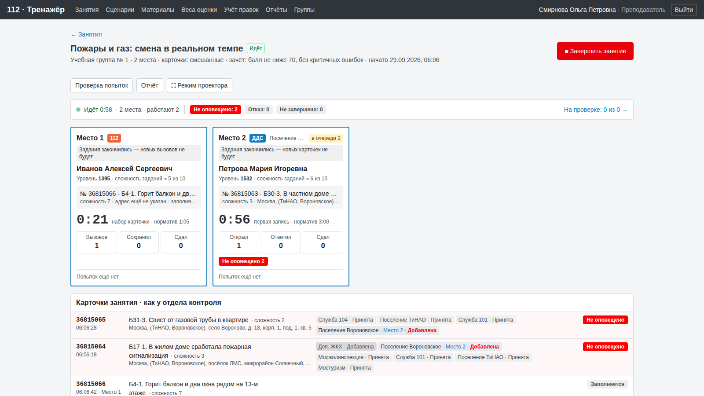

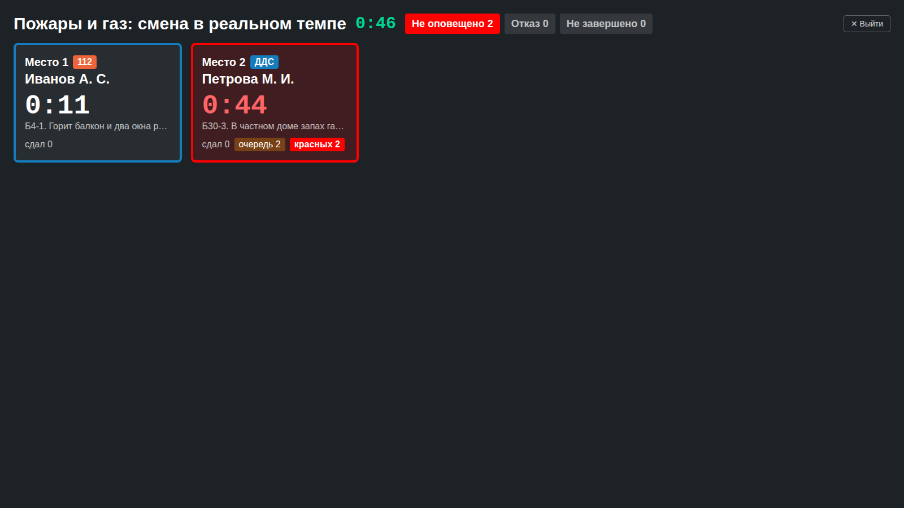

На каждое место — плитка:

- номер места, роль (112 — оранжевая метка, ДДС — синяя), служба, ФИО;
- **уровень** ученика в роли места («как в шахматах») и сложность заданий, которую он подсказывает;
- **текущая карточка**: номер, ситуация, сложность, адрес, статус своей службы;
- **таймер** с нормативом: у ДДС — «открыть карточку» (30 с), затем «первая запись» (3 мин, статус и текст), дальше «работа по карточке» без норматива; у 112 — набор карточки. Просрочка — красным, плитка обводится красным;
- **открыл / ответил / сдал** («ответил» — сделал первую запись: статус и текст; у 112 — вызовов / сохранил / сдал) и очередь карточек;
- красные метки статусов карточки, как у отдела контроля Системы-112, и ошибки по проверкам с самыми частыми.

| Статус карточки | Когда | Цвет |
|---|---|---|
| Не оповещено | служба не открыла карточку за 30 секунд после «Добавлена» — в том числе, пока карточка ждёт в очереди | красный |
| Отказ | «Не принята» или «Отказ от выполнения работ» | красный |
| Не завершено | занятие закончилось (в жизни — прошло 48 ч), а «Работы завершены» нет | красный |
| Заполняется, Зарегистрирована, Завершена | обычный ход | серый |

Статусы считаются только по плашкам, которые ведут места занятия: службы, которые играет система, ученикам не засчитываются. Карточка с места 112, которая ушла сразу нескольким местам ДДС одной службы, стоит в очереди у каждого, пока кто-то её не возьмёт, и никому не приписывается как просрочка.

Под плитками — все карточки занятия: номер, время, место 112, ситуация и её сложность, адрес, плашки служб с местом и статусом, итоговый статус; красные — сверху.

**Режим проектора** — кнопка «⛶ Режим проектора» (адрес `?projector=1`): тёмный экран на всю стену, крупные плитки с таймером, ФИО и красными метками, без лишнего. Для внешнего монитора или проектора в классе.

## 3. Проверка попыток

Попытка — работа одного места над одной карточкой: карточка, заполненная на месте 112, или плашка своей службы на месте ДДС. Рабочие места проверяют попытку правилами (время, порядок статусов, комментарии, адрес, службы, полнота), а понятность текста и «сказал ↔ заполнил» — моделью ИИ. Каждая проверка хранит вердикт, доказательство («"Принята" через 0:50 после "Добавлена"», «Заявитель: "Дубнинская", в карточке: "Дубининская"») и правильный ход.

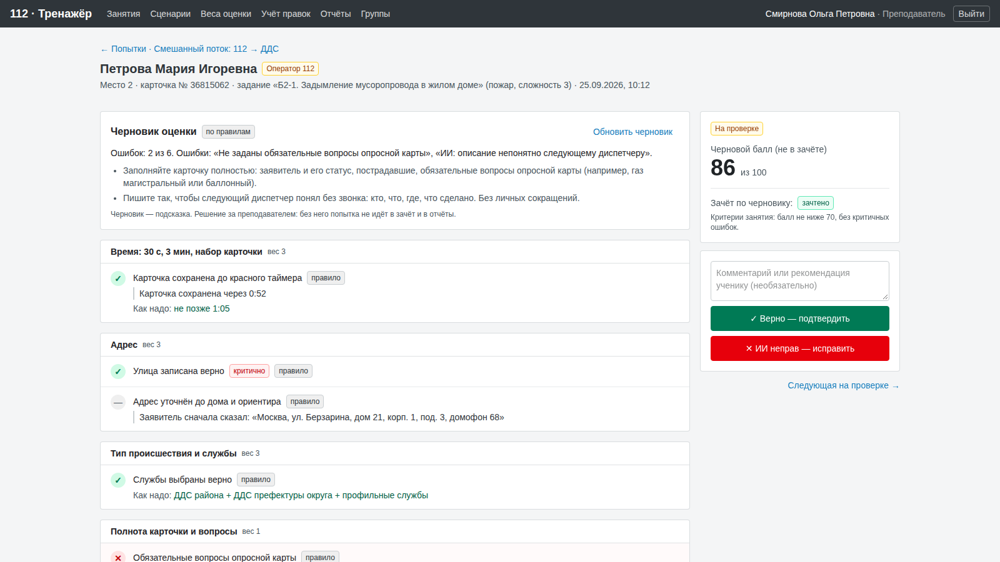

Список попыток занятия — с фильтрами: на проверке / подтверждены / исправлены, роль, место. Экран попытки:

- черновик оценки: итог и советы (по правилам, а если подключена модель — кнопка «Подготовить черновик» просит её объяснить вердикты простыми словами; менять вердикты модели запрещено);
- проверки по группам весов: вердикт, «правило» или «оценил ИИ», критичность, доказательство, «как надо»;
- ход работы: статусы плашки ДДС со временем от «Добавлена» и опозданиями, или разговор с заявителем и карточка 112;
- черновой балл и итоговый балл;
- **зачёт** по критериям занятия с причиной: «не зачтено: балл 62 ниже 70» или «критичная ошибка: …». Пока попытка на проверке, вердикт серый — «по черновику»; при исправлении проверок он пересчитывается сразу.

Решение преподавателя:

- **«Верно — подтвердить»** — черновик верен, попытка идёт в зачёт;
- **«ИИ неправ — исправить»** — у каждой проверки переключатель «Верно / Ошибка / Не применимо» и обязательный комментарий ученику «как надо». Балл пересчитывается сразу, ещё до сохранения. Сохраняются только те проверки, которые преподаватель изменил;
- **«Изменить решение»** и **«Вернуть на проверку»** — если ошибся.

**Утвердить списком.** Класс из 25 человек даёт сотни попыток, поэтому в списке попыток есть галочки и две кнопки: **«Утвердить выбранные»** и **«Утвердить все без критичных ошибок»**. Обе делают то же, что «Верно» на экране попытки: балл и зачёт по черновику, у каждой попытки своя запись в журнале аудита, правки для ИИ-проверок этой попытки снимаются, как при «Верно»; в журнал пишется и сводная запись «Оценки подтверждены списком». Перед утверждением — подтверждение с числом попыток. Не трогаются: уже решённые, попытки, где преподаватель менял проверки или писал комментарий и вернул на проверку (их решают на экране попытки), и — у второй кнопки — попытки с критичной ошибкой. После утверждения видно, сколько подтверждено и сколько осталось решить по одной. Права — как у одиночного решения: свои занятия, у администратора все.

Каждое решение пишется в журнал аудита: кто, когда, статус и балл до и после, какие проверки и как изменены, комментарий. Пока занятие идёт, решения закрыты. После решения — «Следующая на проверке».

**Учёт правок («дообучение»).** Исправление с комментарием сохраняется как правка преподавателя. Проверки ИИ («сказал ↔ заполнил», «описание понятно», «комментарии ДДС понятны») перед оценкой читают до пяти подходящих правок — того же задания, того же типа происшествия, той же группы — и решают похожие случаи так же; у такой проверки в разборе видно «учтены правки преподавателя: N» со списком. Правила не учатся: правка по правилу действует только в своей попытке, при исправлении это написано рядом с каждой изменённой проверкой. «Верно» после «ИИ неправ» отзывает правки этой попытки.

Раздел **«Учёт правок»**: как это работает, сколько правок действует и сколько раз их учли проверки ИИ, какие правила исправляют чаще всего, список правок с фильтрами (действуют / отключены, 112 / ДДС, только мои). Правки — общая методика центра: их видят все преподаватели, ученики в них не упоминаются, ссылка на попытку видна только тому, кто может её открыть. Отключить или снова включить правку может её автор или администратор; отключённая больше не попадает в проверки ИИ. Всё пишется в журнал аудита.

## 4. Веса оценки

Балл попытки — от 0 до 100. Проверки разбиты на семь групп, у каждой группы вес от 0 до 5:

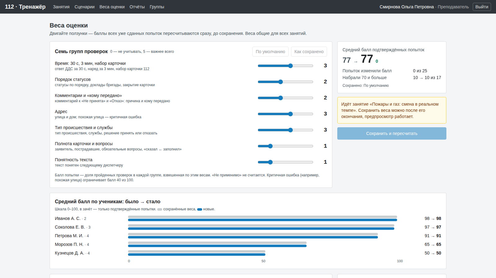

| Группа | Что внутри | По умолчанию |
|---|---|---|
| Время | ДДС: карточка открыта за 30 с и первая запись за 3 мин; набор карточки 112 | 3 |
| Порядок статусов | статусы по порядку, доклады наряда, закрытие карточки | 2 |
| Комментарии и «кому передано» | причина и кому передано у «Не принята» и «Отказа», итог работ | 2 |
| Адрес | улица и дом; похожая улица — критичная ошибка | 3 |
| Тип происшествия и службы | тип, службы, решение принять или отказать | 3 |
| Полнота карточки и вопросы | заявитель, пострадавшие, обязательные вопросы, «сказал ↔ заполнил» | 1 |
| Понятность текста | понятно ли следующему диспетчеру | 1 |

В каждой группе считается доля пройденных проверок, группы складываются по весам. «Не применимо» в расчёт не входит, поэтому попытка, где нечего проверять, не получает 100. Критичная ошибка (похожая улица, отказ от профильного происшествия) ограничивает балл сорока. Время карточки 112 сверх норматива даёт часть балла: чем дольше, тем меньше; ползунок «Время сверх норматива» задаёт, при скольких нормативах баллов за время уже нет (по умолчанию ×2, ×1 — «уложился или нет»). Подробно — [methods.md](methods.md), «Время карточки 112».

Панель «Веса оценки»: двигаете ползунок — и сразу видно «было → стало» до сохранения: средний балл, сколько попыток изменили балл, сколько набрали 70 и больше, средние по ученикам (шкала 0–100), по занятиям и самые большие сдвиги. «Сохранить и пересчитать» делает профиль активным и пересчитывает баллы всех попыток по сохранённым сырым результатам проверок — точно, а не приблизительно. Веса общие для центра; пока идёт занятие, сохранить их нельзя. Изменение весов пишется в аудит.

## 5. Отчёты

«Отчёты» — список проведённых занятий; отчёт открывается и с экрана занятия. В отчёт идут только подтверждённые попытки, про остальные — сколько ждут проверки и ссылка на них.

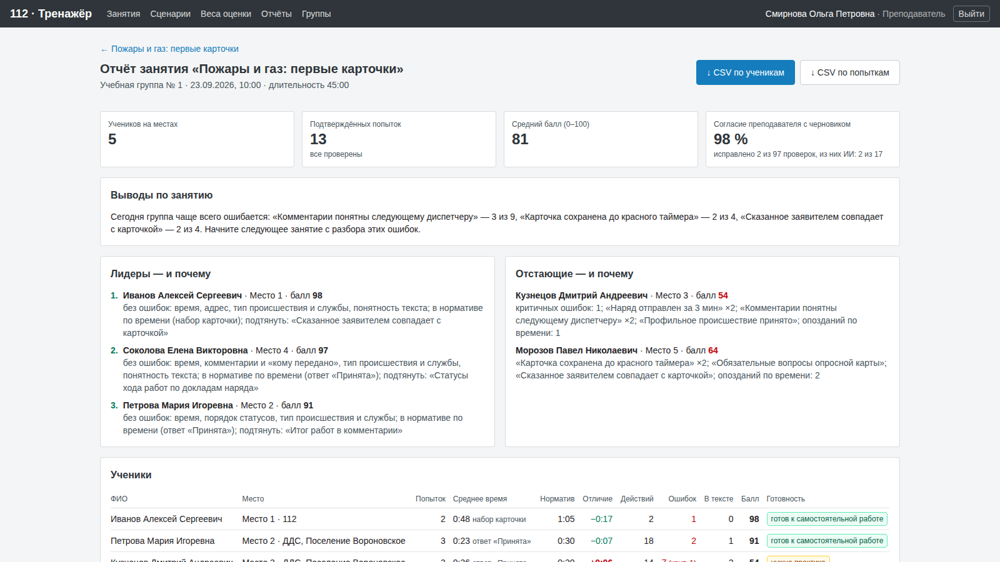

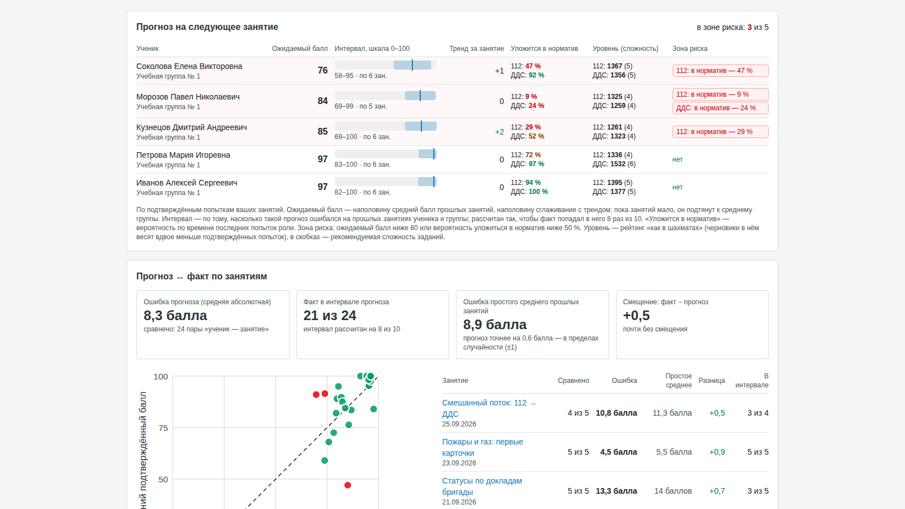

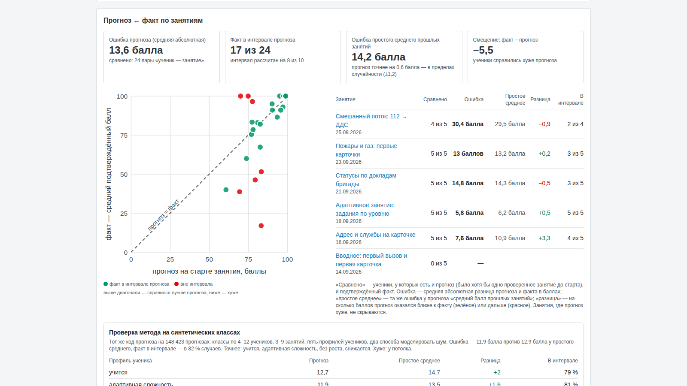

- **Ученики**: ФИО, место и роль, число попыток, среднее время (набор карточки у 112, открытие карточки у ДДС), норматив места, отличие от норматива, опоздания, действия, ошибки, ошибки в тексте, критичные, средний балл, сколько попыток зачтено по критериям занятия, уровень готовности (от «готов к самостоятельной работе» до «нужен разбор с преподавателем»). Критерии зачёта написаны в шапке отчёта.
- **Лидеры и отстающие — и почему**: для лидеров — в каких группах нет ошибок и что подтянуть, для отстающих — самые частые ошибки, критичные, опоздания.
- **Типичные ошибки группы** и вывод одной фразой: «Сегодня группа чаще всего ошибается: …».
- **Согласие преподавателя с черновиком**: какую долю проверок преподаватель оставил как есть, отдельно — проверки ИИ. Это сверка «рекомендации сервиса против реальных».
- **Прогноз ↔ факт**: прогноз, сохранённый на старте занятия, против среднего подтверждённого балла ученика — график «интервал, прогноз, факт» на шкале 0–100 и таблица с ошибкой по каждому ученику и ошибкой простого среднего рядом. Метрики: средняя абсолютная ошибка в баллах, сколько фактов попало в интервал (ждём около 8 из 10), ошибка простого среднего прошлых занятий — с тем, на сколько прогноз точнее или хуже и не в пределах ли это случайности, — и смещение. Там же — прогноз и факт «уложиться в норматив».
- **Уровень учеников «как в шахматах»**: уровень до занятия и после, сложность заданий, которые ученик получил, и какую сложность давать дальше.
- **Графики** без внешних библиотек: средний балл, время против норматива, доля провалов по проверкам и тепловая карта «ученик × группа проверок». Шкалы от нуля, подписи и единицы на месте, легенда цветов.
- **CSV**: по ученикам (с числом зачтённых попыток и критериями) и по попыткам (зачёт и почему не зачтено). UTF-8 с BOM и точкой с запятой — открывается двойным щелчком в Excel с русскими настройками. Выгрузка пишется в аудит.
- **Печать / PDF**: кнопка открывает печать браузера, «Сохранить как PDF» даёт аккуратный отчёт на листах A4 (альбомная ориентация) — без меню и кнопок, с преподавателем и временем формирования в шапке, цвета графиков и тепловой карты сохраняются.
- **Сертификат о прохождении занятия**: у ученика, чьи попытки занятия все проверены и зачтены, в таблице «Ученики» есть ссылка «сертификат» — лист A4 с ФИО, занятием, ролью, датой, итоговым баллом, критериями зачёта и преподавателем; печатается и сохраняется в PDF той же кнопкой. Правило — [methods.md](methods.md), раздел 4.

Над списком занятий в «Отчётах» — два раздела по всем группам преподавателя:

- **Прогноз на следующее занятие**: ожидаемый балл каждого ученика с интервалом, тренд за занятие, вероятность уложиться в норматив на месте 112 и ДДС, уровень в обеих ролях. **Зона риска** — ожидаемый балл ниже 60 или вероятность уложиться в норматив ниже 50 %; такие ученики сверху, с причиной.
- **Прогноз ↔ факт по занятиям**: точечный график «прогноз на старте — факт» с диагональю точного прогноза (обе шкалы 0–100), общая средняя абсолютная ошибка, попадание в интервал, таблица по занятиям с разницей против простого среднего (зелёным — точнее, красным — хуже) и проверка метода на синтетических классах по профилям учеников — включая профиль, где он хуже.

Прогноз — только по подтверждённым попыткам. Формулы простым языком — [methods.md](methods.md), раздел 6.

## 6. Группы

Место на занятии получает только ученик группы, поэтому работа начинается здесь.

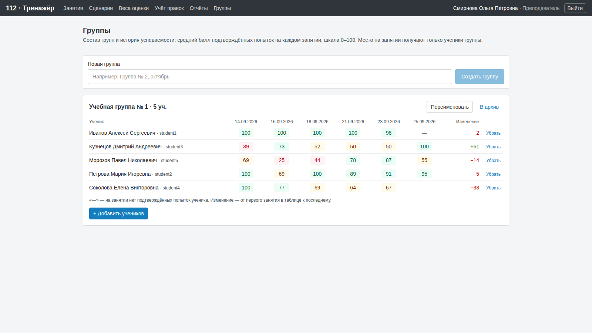

- **Новая группа** — строка вверху страницы: название и «Создать группу». Группа сразу ваша; у одного преподавателя не бывает двух действующих групп с одинаковым названием.
- **Добавить учеников** — кнопка под таблицей группы. Открывается поиск по фамилии, имени или логину среди действующих учётных записей обучающихся; сначала показаны те, кто ещё не в ваших группах. О группах других преподавателей поиск ничего не говорит; администратор видит метку «без группы» у тех, кто ещё ни в одной группе. Ученик может быть в нескольких группах. Новых учеников заводит администратор — он же может сразу записать нового ученика в группу.
- **Убрать** — в строке ученика. Результаты ученика остаются в отчётах. Если он был записан на черновик занятия этой группы, его место из черновика убирается; идущее и проведённое занятие не меняются.
- **Переименовать** и **В архив** — справа от названия. Группа в архиве (курс закончился) пропадает из формы занятия и из прогнозов, её состав нельзя менять, история остаётся; «Вернуть из архива» — в разделе «Архив» внизу страницы.

Таблица группы — история успеваемости: средний подтверждённый балл каждого ученика на последних занятиях и изменение от первого к последнему.

Преподаватель видит и меняет только свои группы: чужая группа отвечает «не найдено», как несуществующая. Администратор видит все группы и назначает им преподавателя (с подтверждением; текущий преподаватель виден, даже если его учётная запись заблокирована). Каждое действие с группой пишется в журнал аудита. На демо-стенде демо-группу «Учебная группа № 1» нельзя переименовать, убрать в архив или убрать из неё демо-учеников — для проб создайте свою группу. Изоляция закрыта автотестом `tests/group-isolation.test.ts`.

## 7. Сценарии

Библиотека сценариев общая для преподавателей центра: 96 ситуаций из билетов заказчика, 3 их варианта с ошибкой в карточке и 4 задания по инструкции оператора (всего 103, утверждены 40), плюс то, что сгенерирует ИИ. Фильтры по статусу (черновики, утверждённые, архив), категории, **локации** (округ или район) и поиску по названию или номеру билета.

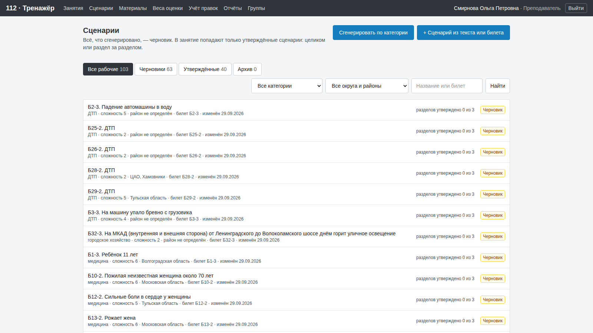

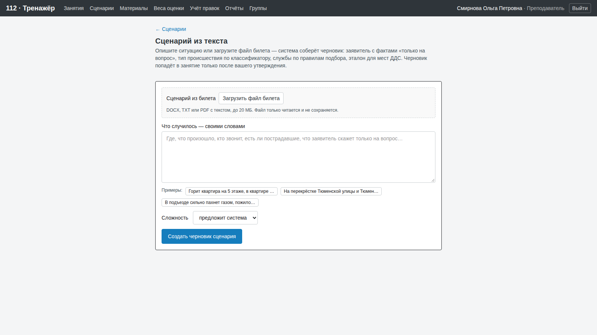

**Локация** сценария — округ и район его адреса: берутся из эталона карточки 112, а если там только улица — из справочника адресов тренажёра. Она видна в строке списка и под названием сценария («СЗАО, Щукино», «Московская область», «район не определён» — для МКАД и мостов). Отдельно локацию хранить не нужно: исправили адрес в эталоне — изменилась и локация.

**Сгенерировать по категории** — кнопка над списком. Нужно выбрать:

- **категорию** — те же категории, что у сценариев: «пожар», «ДТП», «медицина» и другие; под списком видно, из каких групп классификатора она берёт типы и сколько сценариев этой категории уже есть;
- **сколько** черновиков — от 1 до 5;
- **сложность** — от 1 до 10 или «предложит система»;
- **локацию** — округ, район или «любая».

Система подбирает типы происшествий этой категории из классификатора (разные в одном заходе, реже — те, что уже есть в библиотеке), настоящую улицу выбранного района из справочника адресов и номер дома. Рассказ заявителя пишет модель ИИ в духе билетов: кто звонит, что видит, как называет место сначала и что скажет только на вопросы. Без модели рассказ составляется по шаблону из типа и адреса. Чем выше сложность, тем менее точно заявитель называет место сначала (улица с ориентиром или только район), тем труднее у него характер. Службы, обязательные вопросы и эталон для ДДС собираются так же, как у сценария из текста. Готовые черновики появляются списком со ссылками и лежат в «Черновиках»; в заметке преподавателя у каждого записано, из чего он собран: категория, локация, тип и код классификатора, адрес, кто писал рассказ — модель или шаблон. В занятия они попадут только после утверждения.

Сценарий состоит из четырёх разделов, каждый утверждается отдельно:

1. **Заявитель** — кто звонит, что говорит сразу, какой точный адрес называет только на уточняющий вопрос, факты, характер и голос.
2. **Эталон карточки 112** — тип, теги, признаки, адрес, службы, обязательные вопросы, ловушки.
3. **Карточка на месте ДДС** — что видит диспетчер.
4. **Эталон действий ДДС** — решение по каждой службе, цепочка статусов, что должно быть в комментарии, ловушки. Правильный ход подсвечен.

Сценарий готов к занятиям, когда утверждены все его заполненные разделы («Утвердить целиком» — одной кнопкой). Заявителя правят формой, остальные разделы — как JSON с проверкой формата. **«Исправь…»** с замечанием отправляет раздел модели ИИ: она переписывает его, раздел возвращается черновиком, замечание сохраняется в истории сценария. У эталона карточки 112 модель выбирает тип только из короткого списка классификатора, а службы, которые вы прямо назвали («нужны 101 и 103»), тренажёр добивается правилами классификатора — признаком или другим типом; если классификатор их не даёт, добавляет «по указанию преподавателя» и пишет почему. Что сделано, видно сразу после «Исправь…» и в заметке. Без модели (режим заглушки) тренажёр прямо говорит, что перегенерация недоступна, и сохраняет замечание. «В архив» убирает сценарий из занятий, не ломая прошлые результаты. Пока сценарий может выпасть в идущем занятии, его нельзя править, снимать утверждение и убирать в архив. Все действия — в журнале аудита.

## 8. Кабинет обучающегося

«Справка» — памятка, которую можно распечатать: место ДДС (нормативы 30 секунд и 3 минуты, статусы и когда их ставить, порядок статусов, что писать в комментарии, телефон), место 112 (порядок работы и горячие клавиши), как говорить голосом и как ставится оценка. Статусы, нормативы и клавиши берутся из того же кода, что работает на местах, поэтому памятка не расходится с тренажёром. Та же памятка открывается в новой вкладке значком «?» на рабочих местах (`/help`).

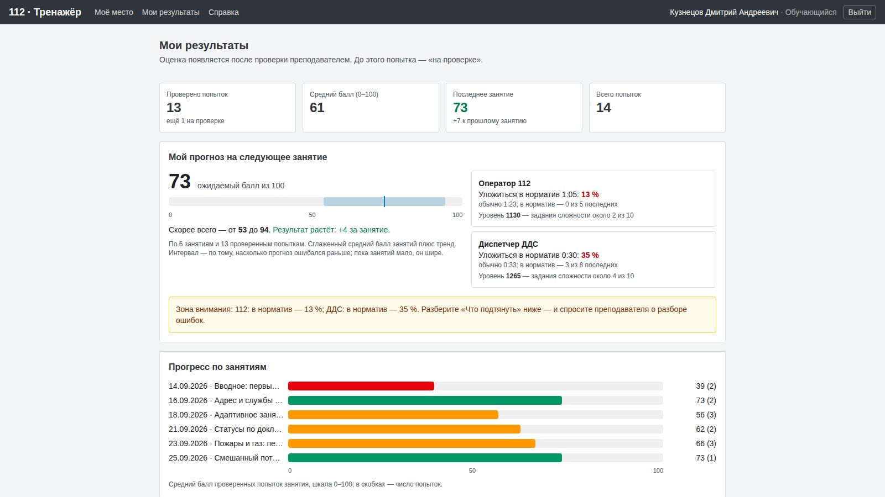

«Моё место» (страница, куда ученик попадает после входа) — **Мои задания**: места ученика в идущих и запланированных занятиях его групп — занятие, группа, преподаватель, роль (112 или ДДС), служба и номер места и только число заданий: «2 вызова по заданиям преподавателя». Названий, категорий и сложности заданий ученик до звонка не видит — ни на странице, ни в ответе API: оператор 112 узнаёт, что случилось, от заявителя, диспетчер ДДС — из карточки, когда она придёт. Если заданий нет, написано, откуда придут карточки: по уровню ученика, из категорий, выбранных преподавателем, или из всех утверждённых сценариев. У идущего занятия — кнопка «Перейти на место», у запланированного — «место откроется, когда преподаватель начнёт занятие». Самостоятельная тренировка заданием не считается.

«Мои результаты»:

- мои задания — тот же список, если что-то назначено сейчас;
- сводка: проверено попыток, средний балл, последнее занятие и сдвиг к прошлому;
- **мой прогноз на следующее занятие**: ожидаемый балл с интервалом и трендом, вероятность уложиться в норматив на месте 112 и ДДС, уровень в каждой роли и сложность заданий, которую он подсказывает. Всё — по проверенным попыткам: черновик на прогноз и уровень не влияет. Если ученик в зоне риска, рядом подсказка, что подтянуть;
- **время реакции** — отдельной цифрой по каждой роли: на месте ДДС — среднее время от «Добавлена» до открытия карточки, на месте 112 — среднее время набора карточки (от «Принять» до «сохранить»); рядом норматив, типичное время и сколько попыток уложились в норматив своего занятия. Как и всё в кабинете — только по попыткам, проверенным преподавателем;
- прогресс по занятиям (шкала 0–100);
- «Что подтянуть» — три самых частых группы ошибок с советом и конкретными примерами «как надо»;
- список попыток. Подтверждённая — балл, «зачтено / не зачтено» с причиной и разбор по проверкам с комментарием преподавателя. Неподтверждённая — только «на проверке»: ни балла, ни зачёта, ни черновика ИИ ученик не видит;
- **сертификаты о прохождении занятий** — по занятиям, где все попытки проверены и зачтены, со ссылкой на печатный сертификат;
- **«Печать / PDF»** — результаты на листах A4 с ФИО и датой.

Ученик видит только свои попытки: каждый запрос к данным фильтруется по его учётной записи, чужая попытка отвечает «не найдено» — так же, как несуществующая. Это закрыто автотестом `tests/student-isolation.test.ts` (задания и время реакции — `tests/student-cabinet-isolation.test.ts`, сертификаты — `tests/certificate-access.test.ts`); изоляция преподавателей (чужие занятия, доска, отчёт, проверка, утверждение списком — «не найдено») — `tests/teacher-isolation.test.ts`, `tests/bulk-review.test.ts`.

## 9. Для разработчика

- Страницы: `src/app/teacher/*`, `src/app/student/*` (группы — `src/app/teacher/groups/*`, у администратора — `/admin/groups`; справка — `src/components/help/TraineeMemo.tsx`).
- Печать и сертификат: кнопка `src/components/PrintButton.tsx`, ориентация листа `src/components/PrintPage.tsx`, стили печати — в конце `src/app/globals.css`; сертификат — `src/components/Certificate.tsx`, страницы `/student/certificates/[lessonId]` (только своё место) и `/teacher/lessons/[id]/certificate/[studentId]` (только свои занятия). Трубку на местах 112 при «Завершить занятие» кладёт `src/lib/lessons/finish.ts` (тест `tests/lesson-stop-calls.test.ts`).
- API: `src/app/api/teacher/*` (занятия, старт/стоп/копия, доска, попытки, решение по попытке, утверждение списком `POST /api/teacher/lessons/[id]/attempts/confirm` (`{ ids, noCritical }`), черновик, веса, отчёт CSV, сценарии, генерация по категории `POST /api/teacher/scenarios/generate`) и `src/app/api/student/*`. Каждый обработчик начинает с проверки сессии и роли; данные читаются через ограничения по владельцу (`src/lib/teacher/access.ts`).
- Логика без базы, покрыта тестами: доска `src/lib/board/state.ts`, решение по попытке `src/lib/review/review.ts`, утверждение списком `src/lib/review/bulk.ts`, сертификат `src/lib/reports/certificate.ts`, отчёт `src/lib/reports/lesson.ts`, CSV `src/lib/reports/csv.ts`, кабинет ученика `src/lib/student/results.ts` (задания — `assignments.ts`, время реакции — `reaction.ts`), утверждение сценариев `src/lib/scenarios/sections.ts`, уровень и адаптивный выбор `src/lib/adaptive/rating.ts`, `pick.ts`, прогноз и сверка `forecast.ts`, `snapshot.ts`.
- Сценарии по категории и локация: связь категорий с группами классификатора — `src/lib/scenarios/categories.ts`, генерация — `by-category.ts` (дальше общий конвейер `generate.ts`), локация по адресу — `location.ts` и `place.ts`, «хватит ли сценариев» для формы, страницы занятия и старта — `src/lib/lessons/coverage.ts`. Место без заданий не получает билет, который в это же время у места другой роли этого занятия (`src/lib/lessons/in-play.ts`), пока есть другой выбор. Тесты: `src/lib/scenarios/*.test.ts`, `src/lib/lessons/coverage.test.ts`, `tests/generate-by-category.test.ts`, `tests/pickers-location.test.ts`, `tests/lesson-start-coverage.test.ts`.
- Адаптация и прогноз: `src/lib/adaptive/` — уровень пересчитывается из попыток при каждом чтении (не хранится), снимок прогноза пишется при старте занятия в `ForecastSnapshot`. API: `/api/student/forecast` (только своё), `/api/teacher/forecast` (группы и занятия преподавателя), `/api/teacher/lessons/[id]/forecast` («прогноз ↔ факт» занятия; чужое — «не найдено»). Изоляция закрыта тестом `tests/forecast-isolation.test.ts`.
- Критерии зачёта: `src/lib/scoring/pass.ts` (вердикт), `src/lib/scoring/template.ts` (шаблон комментария), форма — `src/app/teacher/lessons/PassCriteriaFields.tsx`. Тесты: `pass.test.ts`, `template.test.ts`, `tests/report-pass.test.ts`.
- Учёт правок: `src/lib/review/corrections.ts` (отбор правок, текст для модели, синхронизация с решением — без базы), `corrections-db.ts`, таблица `TeacherCorrection`, страница `/teacher/corrections`, API `POST /api/teacher/corrections/[id]` (`{ active }`, автор или администратор). Проверка ИИ хранит id учтённых правок в `CriterionResult.learned`. Права и изоляция — `tests/corrections-isolation.test.ts`.
- Контракт с рабочими местами: они пишут `Attempt.criteria` как список `CriterionResult` (`src/lib/scoring/score.ts`), а балл считает только `computeScore`. Доска читает карточки, плашки служб, события статусов (с местом, которое действовало), звонки и попытки; место ДДС для сгенерированной карточки — `Incident.ddsSeatId`.
